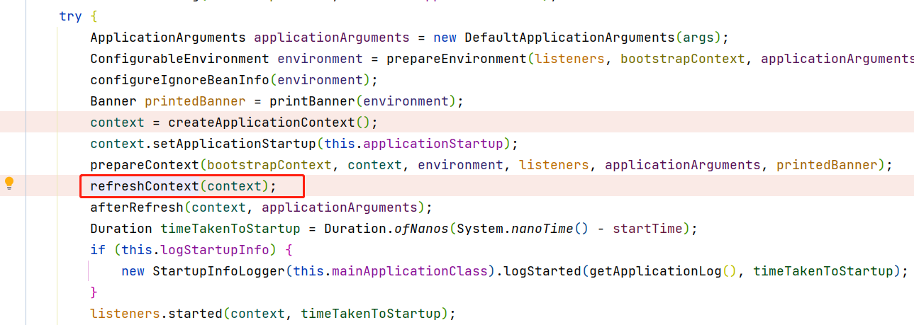
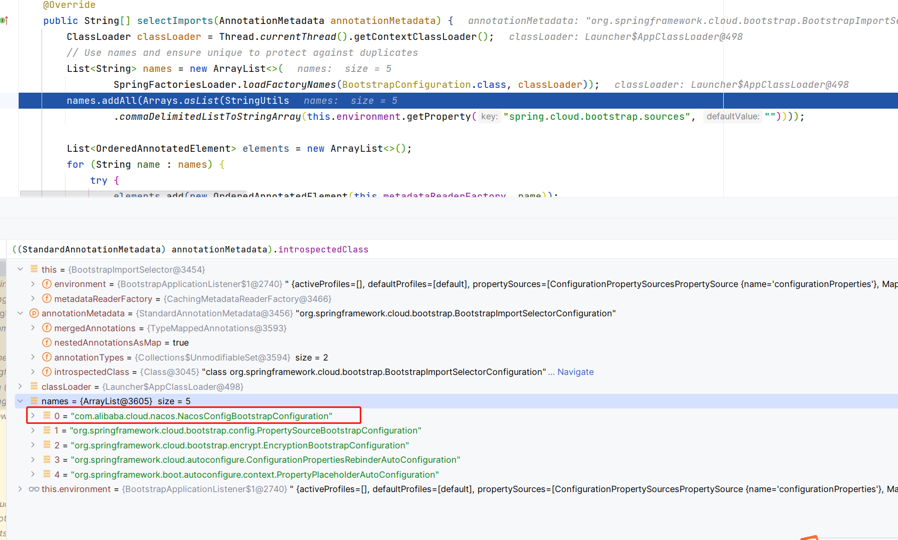

# nacos配置中心集成原理

在spring cloud alibaba中，配置中心是关键性的组件，能够提供便捷的配置管理以及更改配置后无需启动服务，就能够实现配置的自动更新。当然自动更新的操作并不是由nacos来完成，但是涉及以及配置更新通知，则是由nacos来实现的。这篇文章主要介绍nacos配置加载实现。

在[spring boot环境配置文件加载](../../boot/spring boot环境配置文件加载.md)中，我们介绍了spring boot默认配置文件的加载逻辑和实现，在主要的配置文件加载中，并没有对nacos相关的配置进行加载，而是放在了容器的初始化准备阶段。



## 1. BootstrapApplicationListener

这里重提了该类，因为该类在spring-cloud配置的依赖加入后，对spring-boot的环境配置起了很重要的作用，因为在该类的实现中，需要创建一个新的`ApplicationContext`的容器，然后对容器进行实例化的操作，这样的`ApplicationContext`的容器实际上是作为parent的存在，然后在spring-cloud-alibaba版本中，nacos的配置加载则与该类有很重要的联系。

在 创建`ApplicationContext`的逻辑中，会指定`sources`信息，该sources信息主要是`Configuration`类型或者组件类，具体源码如下:

```java
builder.sources(BootstrapImportSelectorConfiguration.class);
		final ConfigurableApplicationContext context = builder.run();
		// gh-214 using spring.application.name=bootstrap to set the context id via
		// `ContextIdApplicationContextInitializer` prevents apps from getting the actual
		// spring.application.name
		// during the bootstrap phase.
		context.setId("bootstrap");
		// Make the bootstrap context a parent of the app context
		addAncestorInitializer(application, context);
		// It only has properties in it now that we don't want in the parent so remove
		// it (and it will be added back later)
		bootstrapProperties.remove(BOOTSTRAP_PROPERTY_SOURCE_NAME);
		mergeDefaultProperties(environment.getPropertySources(), bootstrapProperties);
```

通过源码可以知道，在资源中加入了`BootstrapImportSelectorConfiguration`的类型，而这个类型则是作为初始化`nacos`配置加载的入口。

## 2. SpringApplication

### createApplicationContext()

创建容器的方法这里需要作为重点来说明一下，因为在创建`ApplicationContext`容器的时候，会有许多内置的对象在初始化的时候就被放入到了`ApplicationContext`容器中

```java
	private ApplicationContextFactory applicationContextFactory = ApplicationContextFactory.DEFAULT;
	protected ConfigurableApplicationContext createApplicationContext() {
		return this.applicationContextFactory.create(this.webApplicationType);
	}
```

> 这里将相关的代码放到了一起，便于查看

创建ApplicationContext对象是通过工厂模式进行创建，这个工厂对象是在程序代码中预定义的一个内部类。具体如下：

```java
	ApplicationContextFactory DEFAULT = (webApplicationType) -> {
		try {
			// 通过SPI价值加载ApplicationContextFactory对象，然后通过工厂类进行ApplicationContext的创建
			// 如果创建成功，则直接返回ApplicationContext, 否则就使用AnnotationConfigApplicationContext对象代替
			for (ApplicationContextFactory candidate : SpringFactoriesLoader
					.loadFactories(ApplicationContextFactory.class, ApplicationContextFactory.class.getClassLoader())) {
				ConfigurableApplicationContext context = candidate.create(webApplicationType);
				if (context != null) {
					return context;
				}
			}
			return new AnnotationConfigApplicationContext();
		}
		catch (Exception ex) {
			throw new IllegalStateException("Unable create a default ApplicationContext instance, "
					+ "you may need a custom ApplicationContextFactory", ex);
		}
	};
```

在这段定义中，包含了两层的意思：

- 通过SPI方式可以创建ApplicationContext并且可以阻断后续的工厂类创建ApplicationContext.

- 其次如果在不通过工厂类的方式创建ApplicationContext容器时，默认使用AnnotationConfigApplicationContext来实现。

> 这里有个隐藏信息需要注意：
> 
> 在引入spring-cloud-bootstrap包信息的时候，我们实际上是创建了一个parent的容器来实现bootstrap层面的容器初始化，这个时候的初始化其实与应用类型时无关的，因为在bootstrap的时候，默认是将application设置为`none`的，这里就会显的很重要，因为在bootstrap初始化的时候，如果本身有web的内容，是不会导致web容器的初始化行为。

### AnnotatedBeanDefinitionReader

```java
public AnnotatedBeanDefinitionReader(BeanDefinitionRegistry registry, Environment environment) {
	Assert.notNull(registry, "BeanDefinitionRegistry must not be null");
	Assert.notNull(environment, "Environment must not be null");
	this.registry = registry;
	this.conditionEvaluator = new ConditionEvaluator(registry, environment, null);
	// 注入处理器信息
	AnnotationConfigUtils.registerAnnotationConfigProcessors(this.registry);
}
```

在构造函数中，则包含了对容器一些必要类型的注入操作，

### AnnotationConfigUtils

#### registerAnnotationConfigProcessors()

```java
public static Set<BeanDefinitionHolder> registerAnnotationConfigProcessors(
			BeanDefinitionRegistry registry, @Nullable Object source) {

	// 获取BeanFactory对象
	DefaultListableBeanFactory beanFactory = unwrapDefaultListableBeanFactory(registry);
	if (beanFactory != null) {
		// 设置AnnotationAwareOrderComparator
		if (!(beanFactory.getDependencyComparator() instanceof AnnotationAwareOrderComparator)) {
			beanFactory.setDependencyComparator(AnnotationAwareOrderComparator.INSTANCE);
		}
		// 设置 ContextAnnotationAutowireCandidateResolver
		if (!(beanFactory.getAutowireCandidateResolver() instanceof ContextAnnotationAutowireCandidateResolver)) {
			beanFactory.setAutowireCandidateResolver(new ContextAnnotationAutowireCandidateResolver());
		}
	}

	Set<BeanDefinitionHolder> beanDefs = new LinkedHashSet<>(8);

	// 判断是否包含了org.springframework.context.annotation.internalConfigurationAnnotationProcessor的bean定义对象，如果没有包含
	// 则新增ConfigurationClassPostProcessor为定义对象
	// 这个类就很重要了，他是加载Configuration实现的重要类型
	if (!registry.containsBeanDefinition(CONFIGURATION_ANNOTATION_PROCESSOR_BEAN_NAME)) {
		RootBeanDefinition def = new RootBeanDefinition(ConfigurationClassPostProcessor.class);
		def.setSource(source);
		beanDefs.add(registerPostProcessor(registry, def, CONFIGURATION_ANNOTATION_PROCESSOR_BEAN_NAME));
	}

	// 判断是否包含了org.springframework.context.annotation.internalAutowiredAnnotationProcessor的bean定义对象
	// 如果没有，则加入AutowiredAnnotationBeanPostProcessor定义
	if (!registry.containsBeanDefinition(AUTOWIRED_ANNOTATION_PROCESSOR_BEAN_NAME)) {
		RootBeanDefinition def = new RootBeanDefinition(AutowiredAnnotationBeanPostProcessor.class);
		def.setSource(source);
		beanDefs.add(registerPostProcessor(registry, def, AUTOWIRED_ANNOTATION_PROCESSOR_BEAN_NAME));
	}

	// Check for JSR-250 support, and if present add the CommonAnnotationBeanPostProcessor.
	// 这是对JSR-250的支持，判断是否加入了org.springframework.context.annotation.internalCommonAnnotationProcessor的定义
	// 如果没有，则加入CommonAnnotationBeanPostProcessor定义
	if (jsr250Present && !registry.containsBeanDefinition(COMMON_ANNOTATION_PROCESSOR_BEAN_NAME)) {
		RootBeanDefinition def = new RootBeanDefinition(CommonAnnotationBeanPostProcessor.class);
		def.setSource(source);
		beanDefs.add(registerPostProcessor(registry, def, COMMON_ANNOTATION_PROCESSOR_BEAN_NAME));
	}

	// Check for JPA support, and if present add the PersistenceAnnotationBeanPostProcessor.
	if (jpaPresent && !registry.containsBeanDefinition(PERSISTENCE_ANNOTATION_PROCESSOR_BEAN_NAME)) {
		RootBeanDefinition def = new RootBeanDefinition();
		try {
			def.setBeanClass(ClassUtils.forName(PERSISTENCE_ANNOTATION_PROCESSOR_CLASS_NAME,
					AnnotationConfigUtils.class.getClassLoader()));
		}
		catch (ClassNotFoundException ex) {
			throw new IllegalStateException(
					"Cannot load optional framework class: " + PERSISTENCE_ANNOTATION_PROCESSOR_CLASS_NAME, ex);
		}
		def.setSource(source);
		beanDefs.add(registerPostProcessor(registry, def, PERSISTENCE_ANNOTATION_PROCESSOR_BEAN_NAME));
	}

	// org.springframework.context.event.internalEventListenerProcessor的定义
	if (!registry.containsBeanDefinition(EVENT_LISTENER_PROCESSOR_BEAN_NAME)) {
		RootBeanDefinition def = new RootBeanDefinition(EventListenerMethodProcessor.class);
		def.setSource(source);
		beanDefs.add(registerPostProcessor(registry, def, EVENT_LISTENER_PROCESSOR_BEAN_NAME));
	}

	// org.springframework.context.event.internalEventListenerFactory的定义
	if (!registry.containsBeanDefinition(EVENT_LISTENER_FACTORY_BEAN_NAME)) {
		RootBeanDefinition def = new RootBeanDefinition(DefaultEventListenerFactory.class);
		def.setSource(source);
		beanDefs.add(registerPostProcessor(registry, def, EVENT_LISTENER_FACTORY_BEAN_NAME));
	}

	return beanDefs;
}
```

在以上的过程中，就做好了容器刷新的初始准备，接下来就是刷新，然后通过配置加载各种配置定义信息。

### prepareContext()

```java
	private void prepareContext(DefaultBootstrapContext bootstrapContext, ConfigurableApplicationContext context,
			ConfigurableEnvironment environment, SpringApplicationRunListeners listeners,
			ApplicationArguments applicationArguments, Banner printedBanner) {
		// 设置环境配置
		context.setEnvironment(environment);
		// 处理容器
		postProcessApplicationContext(context);
		// 执行ApplicationContextInitializer中的intialize方法，处理必要参数
		applyInitializers(context);
		// 广播ApplicationContextInitializedEvent时间
		listeners.contextPrepared(context);
		// 关闭BootstrapContext容器，并准备ApplicationContext
		bootstrapContext.close(context);
		if (this.logStartupInfo) {
			logStartupInfo(context.getParent() == null);
			logStartupProfileInfo(context);
		}
		// 获取BeanFactory对象
		ConfigurableListableBeanFactory beanFactory = context.getBeanFactory();
		// 注册命令行参数对象
		beanFactory.registerSingleton("springApplicationArguments", applicationArguments);
		// 打印banner信息
		if (printedBanner != null) {
			beanFactory.registerSingleton("springBootBanner", printedBanner);
		}
		// 设置allowBeanFefinitionOverriding参数
		if (beanFactory instanceof AbstractAutowireCapableBeanFactory) {
			((AbstractAutowireCapableBeanFactory) beanFactory).setAllowCircularReferences(this.allowCircularReferences);
			if (beanFactory instanceof DefaultListableBeanFactory) {
				((DefaultListableBeanFactory) beanFactory)
						.setAllowBeanDefinitionOverriding(this.allowBeanDefinitionOverriding);
			}
		}
		// 是否懒加载，如果支持懒加载，则LazyInitializationBeanFactoryPostProcessor实例
		if (this.lazyInitialization) {
			context.addBeanFactoryPostProcessor(new LazyInitializationBeanFactoryPostProcessor());
		}
		// 新增PropertySourceOrderingBeanFactoryPostProcessor实例
		context.addBeanFactoryPostProcessor(new PropertySourceOrderingBeanFactoryPostProcessor(context));
		// 获取需要加载的资源列表，也即是启动源类型
		Set<Object> sources = getAllSources();
		Assert.notEmpty(sources, "Sources must not be empty");
		// 加载资源
		load(context, sources.toArray(new Object[0]));
		// 发送事件ApplicationPreparedEvent
		listeners.contextLoaded(context);
	}
```

准备工作主要是对ApplicaionContext声明周期的管理和操作，其中也设计到了SPI自定义的一些步骤，同时，在不同阶段，都会发送事件通知信息。

### load()

```java
	protected void load(ApplicationContext context, Object[] sources) {
		if (logger.isDebugEnabled()) {
			logger.debug("Loading source " + StringUtils.arrayToCommaDelimitedString(sources));
		}
		// 创建BeanDefinitionLoader对象，该对象持有启动源信息
		BeanDefinitionLoader loader = createBeanDefinitionLoader(getBeanDefinitionRegistry(context), sources);
		if (this.beanNameGenerator != null) {
			loader.setBeanNameGenerator(this.beanNameGenerator);
		}
		if (this.resourceLoader != null) {
			loader.setResourceLoader(this.resourceLoader);
		}
		if (this.environment != null) {
			loader.setEnvironment(this.environment);
		}
		// 执行加载操作
		loader.load();
	}
```

> 这里需要注意一下，在引入了spring-cloud-bootstrap依赖的时候，这里加载parent的容器时，这里的源只有一个: `org.springframework.cloud.bootstrap.BootstrapImportSelectorConfiguration` 这个类的来源实在parent被创建的时候自动设置进去的。

因此这里的加载，实际上是对`BootstrapImportSelectorConfiguration`类型的处理。

> load()方法处理完成之后，实际上在BeanFactory中就包含了BootstrapImportSelectorConfiguration的定义信息，也就是BeanDefinition信息。

### refresh()

在知道了处理nacos配置的入口后，则我们主要关系在执行`run()`方法的时候，会通过`refreshContext()`方法刷新容器，具体如下：

```java
	protected void refresh(ConfigurableApplicationContext applicationContext) {
		applicationContext.refresh();
	}
```

这里就最终调用了`ApplicationContext#refresh()`方法，因此我们只需要看对应的方法即可。

## 3. AbstractApplicationContext

### refresh()

> 因为这篇文章不是为了介绍ApplicationContext的加载过程，因此里面的步骤不会做详细介绍，而是只支出关键的配置步骤

```java
try {
	...
	// Invoke factory processors registered as beans in the context.
	// 执行BeanFactoryPostProcessor实例的方法
	invokeBeanFactoryPostProcessors(beanFactory);
	...

}

```

### invokeBeanFactoryPostProcessors()

```java
public static void invokeBeanFactoryPostProcessors(
			ConfigurableListableBeanFactory beanFactory, List<BeanFactoryPostProcessor> beanFactoryPostProcessors) {

		Set<String> processedBeans = new HashSet<>();

		// 判断beanFactory是否为BeanDefinitionRegistry实例
		if (beanFactory instanceof BeanDefinitionRegistry) {
			BeanDefinitionRegistry registry = (BeanDefinitionRegistry) beanFactory;
			List<BeanFactoryPostProcessor> regularPostProcessors = new ArrayList<>();
			List<BeanDefinitionRegistryPostProcessor> registryProcessors = new ArrayList<>();

			// 执行BeanFactoryPostProcessor实例，这里主要是对BeanFactory进行后置处理
			for (BeanFactoryPostProcessor postProcessor : beanFactoryPostProcessors) {
				if (postProcessor instanceof BeanDefinitionRegistryPostProcessor) {
					BeanDefinitionRegistryPostProcessor registryProcessor =
							(BeanDefinitionRegistryPostProcessor) postProcessor;
					registryProcessor.postProcessBeanDefinitionRegistry(registry);
					registryProcessors.add(registryProcessor);
				}
				else {
					regularPostProcessors.add(postProcessor);
				}
			}

			List<BeanDefinitionRegistryPostProcessor> currentRegistryProcessors = new ArrayList<>();

			// 这步骤是为了获取BeanDefinitionRegistryPostProcessor相关的beanName列表
			String[] postProcessorNames =
					beanFactory.getBeanNamesForType(BeanDefinitionRegistryPostProcessor.class, true, false);
			// 遍历BeanDefinitionRegistryPostProcessor名称信息
			for (String ppName : postProcessorNames) {
				// 判断当前beanName代表的class对象是否为PriortyOrdered的实现类
				if (beanFactory.isTypeMatch(ppName, PriorityOrdered.class)) {
					// 如果条件满足，则通过getBean()方法创建bean，并加入到currentRegistryProcessors集合中
					currentRegistryProcessors.add(beanFactory.getBean(ppName, BeanDefinitionRegistryPostProcessor.class));
					processedBeans.add(ppName);
				}
			}
			// 对BeanDefinitionRegistryPostProcessor实例列表进行优先级排序
			sortPostProcessors(currentRegistryProcessors, beanFactory);
			registryProcessors.addAll(currentRegistryProcessors);
			// 执行BeanDefinitionRegistryPostProcessor实例
			invokeBeanDefinitionRegistryPostProcessors(currentRegistryProcessors, registry, beanFactory.getApplicationStartup());
			currentRegistryProcessors.clear();

			// 获取BeanDefinitionRegistryPostProcessor实例列表，并按照Ordered排序，然后执行BeanDefinitionRegistryPostProcessor逻辑
			postProcessorNames = beanFactory.getBeanNamesForType(BeanDefinitionRegistryPostProcessor.class, true, false);
			for (String ppName : postProcessorNames) {
				if (!processedBeans.contains(ppName) && beanFactory.isTypeMatch(ppName, Ordered.class)) {
					currentRegistryProcessors.add(beanFactory.getBean(ppName, BeanDefinitionRegistryPostProcessor.class));
					processedBeans.add(ppName);
				}
			}
			sortPostProcessors(currentRegistryProcessors, beanFactory);
			registryProcessors.addAll(currentRegistryProcessors);
			invokeBeanDefinitionRegistryPostProcessors(currentRegistryProcessors, registry, beanFactory.getApplicationStartup());
			currentRegistryProcessors.clear();

			// 如果BeanDefinitionRegistryPostProcessor没有实现任何的排序规则或者逻辑，则最后执行，优先级最低
			boolean reiterate = true;
			while (reiterate) {
				reiterate = false;
				postProcessorNames = beanFactory.getBeanNamesForType(BeanDefinitionRegistryPostProcessor.class, true, false);
				for (String ppName : postProcessorNames) {
					if (!processedBeans.contains(ppName)) {
						currentRegistryProcessors.add(beanFactory.getBean(ppName, BeanDefinitionRegistryPostProcessor.class));
						processedBeans.add(ppName);
						reiterate = true;
					}
				}
				sortPostProcessors(currentRegistryProcessors, beanFactory);
				registryProcessors.addAll(currentRegistryProcessors);
				invokeBeanDefinitionRegistryPostProcessors(currentRegistryProcessors, registry, beanFactory.getApplicationStartup());
				currentRegistryProcessors.clear();
			}

			// Now, invoke the postProcessBeanFactory callback of all processors handled so far.
			invokeBeanFactoryPostProcessors(registryProcessors, beanFactory);
			invokeBeanFactoryPostProcessors(regularPostProcessors, beanFactory);
		}

		else {
			// Invoke factory processors registered with the context instance.
			invokeBeanFactoryPostProcessors(beanFactoryPostProcessors, beanFactory);
		}

		...
	}
```

## 4. ConfigurationClassPostProcessor

对于配置类型的加载，主要是通过该类来完成的。

### postProcessBeanDefinitionRegistry()

```java
	public void postProcessBeanDefinitionRegistry(BeanDefinitionRegistry registry) {
		// 获取编号
		int registryId = System.identityHashCode(registry);
		// 判断是否已经执行了post process
		if (this.registriesPostProcessed.contains(registryId)) {
			throw new IllegalStateException(
					"postProcessBeanDefinitionRegistry already called on this post-processor against " + registry);
		}
		// 是否通过工厂类执行过注册
		if (this.factoriesPostProcessed.contains(registryId)) {
			throw new IllegalStateException(
					"postProcessBeanFactory already called on this post-processor against " + registry);
		}
		// 将当前注册编号加入到registriesPostProcessed列表中
		this.registriesPostProcessed.add(registryId);

		// 指定bean定义配置
		processConfigBeanDefinitions(registry);
	}
```

### processConfigBeanDefinitions()

```java
public void processConfigBeanDefinitions(BeanDefinitionRegistry registry) {
	List<BeanDefinitionHolder> configCandidates = new ArrayList<>();
	// 获取registry中已经注册的BeanDefinition名称列表
	String[] candidateNames = registry.getBeanDefinitionNames();

	//遍历bean名称
	for (String beanName : candidateNames) {
		// 获取对应的beanName的类型定义信息
		BeanDefinition beanDef = registry.getBeanDefinition(beanName);
		// 判断是否包含属性org.springframework.context.annotation.ConfigurationClassPostProcessor.configurationClass
		if (beanDef.getAttribute(ConfigurationClassUtils.CONFIGURATION_CLASS_ATTRIBUTE) != null) {
			if (logger.isDebugEnabled()) {
				logger.debug("Bean definition has already been processed as a configuration class: " + beanDef);
			}
		}
		// 判断是否与Configuration类的加载逻辑，主要是对@Configuration逻辑的处理
		// 若成立，则加入到configCandidates列表中
		else if (ConfigurationClassUtils.checkConfigurationClassCandidate(beanDef, this.metadataReaderFactory)) {
			configCandidates.add(new BeanDefinitionHolder(beanDef, beanName));
		}
	}

	// 如果configCandidates为空，则表示没有Configuration类需要处理
	if (configCandidates.isEmpty()) {
		return;
	}

	// 根据@Order注解进行排序
	configCandidates.sort((bd1, bd2) -> {
		int i1 = ConfigurationClassUtils.getOrder(bd1.getBeanDefinition());
		int i2 = ConfigurationClassUtils.getOrder(bd2.getBeanDefinition());
		return Integer.compare(i1, i2);
	});

	// Detect any custom bean name generation strategy supplied through the enclosing application context
	SingletonBeanRegistry sbr = null;
	if (registry instanceof SingletonBeanRegistry) {
		sbr = (SingletonBeanRegistry) registry;
		// 这里主要是为了探测自定义bean名称生成策略
		if (!this.localBeanNameGeneratorSet) {
			BeanNameGenerator generator = (BeanNameGenerator) sbr.getSingleton(
					AnnotationConfigUtils.CONFIGURATION_BEAN_NAME_GENERATOR);
			if (generator != null) {
				this.componentScanBeanNameGenerator = generator;
				this.importBeanNameGenerator = generator;
			}
		}
	}

	if (this.environment == null) {
		this.environment = new StandardEnvironment();
	}

	// 创建ConfigurationClassParser对象，该对象用于解析@Configuration注解有关的配置类信息
	ConfigurationClassParser parser = new ConfigurationClassParser(
			this.metadataReaderFactory, this.problemReporter, this.environment,
			this.resourceLoader, this.componentScanBeanNameGenerator, registry);

	Set<BeanDefinitionHolder> candidates = new LinkedHashSet<>(configCandidates);
	Set<ConfigurationClass> alreadyParsed = new HashSet<>(configCandidates.size());
	do {
		StartupStep processConfig = this.applicationStartup.start("spring.context.config-classes.parse");
		// 开始解析Configuration配置类
		parser.parse(candidates);
		parser.validate();

		Set<ConfigurationClass> configClasses = new LinkedHashSet<>(parser.getConfigurationClasses());
		configClasses.removeAll(alreadyParsed);

		// Read the model and create bean definitions based on its content
		if (this.reader == null) {
			this.reader = new ConfigurationClassBeanDefinitionReader(
					registry, this.sourceExtractor, this.resourceLoader, this.environment,
					this.importBeanNameGenerator, parser.getImportRegistry());
		}
		// 在parse类中，实现了对Configuration类型的加载，当有了这些Configuration类型之后
		// 则需要将Configuration中包含有@Bean这些方法解析为BeanDefinition对象，以便于对这些类型进行初始化
		this.reader.loadBeanDefinitions(configClasses);
		alreadyParsed.addAll(configClasses);
		processConfig.tag("classCount", () -> String.valueOf(configClasses.size())).end();

		candidates.clear();
		if (registry.getBeanDefinitionCount() > candidateNames.length) {
			String[] newCandidateNames = registry.getBeanDefinitionNames();
			Set<String> oldCandidateNames = new HashSet<>(Arrays.asList(candidateNames));
			Set<String> alreadyParsedClasses = new HashSet<>();
			// 将已经加载的配置类放到已经解析的列表中
			for (ConfigurationClass configurationClass : alreadyParsed) {
				alreadyParsedClasses.add(configurationClass.getMetadata().getClassName());
			}
			// 新增配置类型，则加入到candidates列表中
			for (String candidateName : newCandidateNames) {
				if (!oldCandidateNames.contains(candidateName)) {
					BeanDefinition bd = registry.getBeanDefinition(candidateName);
					if (ConfigurationClassUtils.checkConfigurationClassCandidate(bd, this.metadataReaderFactory) &&
							!alreadyParsedClasses.contains(bd.getBeanClassName())) {
						candidates.add(new BeanDefinitionHolder(bd, candidateName));
					}
				}
			}
			// 将新的参与类复制，再次进行遍历
			candidateNames = newCandidateNames;
		}
	}
	// 循环遍历
	while (!candidates.isEmpty());

	// Register the ImportRegistry as a bean in order to support ImportAware @Configuration classes
	if (sbr != null && !sbr.containsSingleton(IMPORT_REGISTRY_BEAN_NAME)) {
		sbr.registerSingleton(IMPORT_REGISTRY_BEAN_NAME, parser.getImportRegistry());
	}

	if (this.metadataReaderFactory instanceof CachingMetadataReaderFactory) {
		// Clear cache in externally provided MetadataReaderFactory; this is a no-op
		// for a shared cache since it'll be cleared by the ApplicationContext.
		((CachingMetadataReaderFactory) this.metadataReaderFactory).clearCache();
	}
}
```

> 因此经过以上步骤之后，则对应的Configuraion类被加载并且类中的@Bean配置已经注入到了BeanFactory中，这个时候，就设计到初始化Bean的操作

## 5. ConfigurationClassParser

### parse()

```java
public void parse(Set<BeanDefinitionHolder> configCandidates) {
		// 开始遍历Configuration的类定义信息
		for (BeanDefinitionHolder holder : configCandidates) {
			// 获取Configuration的BeanDefinition信息
			BeanDefinition bd = holder.getBeanDefinition();
			try {
				// 判断是否为AnnotatedBeanDefinition, 如果是，则执行对应逻辑
				// 这里在bootstrap阶段，对应的类型为BootstrapImportSelectorConfiguration,
				// 该类因为涉及到注解的使用信息，因此为AnnotatedBeanDefinition定义
				// parse()操作会将对应的@Configuration以及@Import等注解解析为可执行的实例
				if (bd instanceof AnnotatedBeanDefinition) {
					parse(((AnnotatedBeanDefinition) bd).getMetadata(), holder.getBeanName());
				}
				else if (bd instanceof AbstractBeanDefinition && ((AbstractBeanDefinition) bd).hasBeanClass()) {
					parse(((AbstractBeanDefinition) bd).getBeanClass(), holder.getBeanName());
				}
				else {
					parse(bd.getBeanClassName(), holder.getBeanName());
				}
			}
			catch (BeanDefinitionStoreException ex) {
				throw ex;
			}
			catch (Throwable ex) {
				throw new BeanDefinitionStoreException(
						"Failed to parse configuration class [" + bd.getBeanClassName() + "]", ex);
			}
		}

		this.deferredImportSelectorHandler.process();
	}
```

> 这里没有介绍详细的过程，是因为这个属于spring-boot注解加载过程，因此不在这次的讨论范围内，可以参考加载的过程

### DeferredImportSelectorHandler

该类是作为ConfigurationClassParser的内部类，该类主要处理@Import相关的配置类的引入逻辑。

```java
public void process() {
	// 获取Import列表。当加载source中包含了@Import注解的时候，则不为空
	List<DeferredImportSelectorHolder> deferredImports = this.deferredImportSelectors;
	this.deferredImportSelectors = null;
	try {
		if (deferredImports != null) {
			// 创建处理@Import逻辑的类实例
			DeferredImportSelectorGroupingHandler handler = new DeferredImportSelectorGroupingHandler();
			deferredImports.sort(DEFERRED_IMPORT_COMPARATOR);
			// 将DeferredImportSelectorHolder类型注册到deferredImports列表中
			deferredImports.forEach(handler::register);
			// 处理@Import逻辑
			handler.processGroupImports();
		}
	}
	finally {
		this.deferredImportSelectors = new ArrayList<>();
	}
}
```

### DeferredImportSelectorGroupingHandler

```java
public void processGroupImports() {
	// 开始遍历DeferredImportSelectorGrouping信息，
	for (DeferredImportSelectorGrouping grouping : this.groupings.values()) {
		Predicate<String> exclusionFilter = grouping.getCandidateFilter();
		// 从grouping中获取Imports列表，这里需要主要关注下getImports()方法
		// 因为一个Configuration类可能会引入很多的配置类，然后会遍历去导入
		// 其他的配置类，这里也是nacos加载配置扩展的点。
		grouping.getImports().forEach(entry -> {
			ConfigurationClass configurationClass = this.configurationClasses.get(entry.getMetadata());
			try {
				// 加载其他的配置类，和上面逻辑基本一致
				processImports(configurationClass, asSourceClass(configurationClass, exclusionFilter),
						Collections.singleton(asSourceClass(entry.getImportClassName(), exclusionFilter)),
						exclusionFilter, false);
			}
			catch (BeanDefinitionStoreException ex) {
				throw ex;
			}
			catch (Throwable ex) {
				throw new BeanDefinitionStoreException(
						"Failed to process import candidates for configuration class [" +
								configurationClass.getMetadata().getClassName() + "]", ex);
			}
		});
	}
}
```

通过以上的源码分析，`getImports()`方法中有加载其他配置类的功能，因此，将主要关注`getImports()`方法的实现。

### DeferredImportSelectorGrouping

#### getImports()

```java
public Iterable<Group.Entry> getImports() {
	// 遍历DeferredImportSelectorHolder，该类中保存中@Import注解中需要保存的类型，分别处理对应的导入逻辑
	for (DeferredImportSelectorHolder deferredImport : this.deferredImports) {
		// 开始处理单个selector导入
		this.group.process(deferredImport.getConfigurationClass().getMetadata(),
				deferredImport.getImportSelector());
	}
	return this.group.selectImports();
}
```

### DefaultDeferredImportSelectorGroup

#### process()

```java
public void process(AnnotationMetadata metadata, DeferredImportSelector selector) {
	// 通过selector#selectImports()方法获取导入的class名称列表, 并加入到导入列表中
	for (String importClassName : selector.selectImports(metadata)) {
		this.imports.add(new Entry(metadata, importClassName));
	}
}
```

这里主要通过selector的实现获取导入类的列表，以此完成加载其他配置类的目的。

## 6. BootstrapImportSelector

在bootstrap阶段，因为当前源为`class org.springframework.cloud.bootstrap.BootstrapImportSelectorConfiguration`配置类，该类实际上也是通过`@Import`注解引入了`BootstrapImportSelector`类的加载过程，因此这里最终会调用到当前的类中。

```java
public String[] selectImports(AnnotationMetadata annotationMetadata) {
	// 获取类加载器
	ClassLoader classLoader = Thread.currentThread().getContextClassLoader();
	// 这里通过SPI机制，加载BootstrapConfiguration实现类名称列表
	// 这里使用类名称而不是类的实例，主要是为了防止相同类的重复加载
	List<String> names = new ArrayList<>(
			SpringFactoriesLoader.loadFactoryNames(BootstrapConfiguration.class, classLoader));
	// 从spring.cloud.bootstrap.sources中加载需要配置的类列表
	names.addAll(Arrays.asList(StringUtils
			.commaDelimitedListToStringArray(this.environment.getProperty("spring.cloud.bootstrap.sources", ""))));

	List<OrderedAnnotatedElement> elements = new ArrayList<>();
	// 遍历并创建OrderedAnnotatedElement类型，并加入到待加入类列表
	for (String name : names) {
		try {
			elements.add(new OrderedAnnotatedElement(this.metadataReaderFactory, name));
		}
		catch (IOException e) {
			continue;
		}
	}
	// 排序
	AnnotationAwareOrderComparator.sort(elements);

	String[] classNames = elements.stream().map(e -> e.name).toArray(String[]::new);

	return classNames;
}
```



因此通过该方式后，`NacosConfigBootstrapConfiguration`的配置类就被加入到了内存，紧接着就是对该配置类的处理。

这里需要注意，从spring-cloud的角度来说，扩展类加载配置有两种方式：

- 第一种就是通过SPI的方式进行配置，在`spring.factories`中配置`org.springframework.cloud.bootstrap.BootstrapConfiguration=`即可

- 第二种就是通过`spring.cloud.bootstrap.sources`配置需要加载类列表

## 7. Nacos加载配置到Environment中

通过以上的过程解析，我们明白了nacos是如何将配置放到容器中进行加载和初始化bean的过程。当主备工作完成之后，实际上与nacos有关的配置加载的类定义就已经在`BeanFactory`中。

### SpringApplication#applyInitializers()

再次回到这个类的时候，主要是因为在执行准备阶段，会执行ApplicationContextInitializer初始化实例的初始化方法，其中有一个类`org.springframework.cloud.bootstrap.config.PropertySourceBootstrapConfiguration`该类会初始化所有的`PropertySourceLocator`实例，并调用`locate()`方法加载配置数据信息。

### NacosPropertySourceLocator

该类就是nacos具体加载配置文件的地方。可以通过该类查看配置加载的源码信息。

#### loadSharedConfiguration()

加载共享配置信息

```java
	private void loadSharedConfiguration(
			CompositePropertySource compositePropertySource) {
		// 获取spring.cloud.nacos.config.share-configs配置，
		// 这里配置也是通过指定前缀和配置名称加载的，因此不做过解释
		List<NacosConfigProperties.Config> sharedConfigs = nacosConfigProperties
				.getSharedConfigs();
		if (!CollectionUtils.isEmpty(sharedConfigs)) {
			checkConfiguration(sharedConfigs, "shared-configs");
			loadNacosConfiguration(compositePropertySource, sharedConfigs);
		}
	}
```

#### loadExtConfiguration()

`spring.cloud.nacos.config.ext-configs`配置加载

```java
	private void loadExtConfiguration(CompositePropertySource compositePropertySource) {
		// 获取ext-configs配置信息，如果配置存在，则加载配置文件
		List<NacosConfigProperties.Config> extConfigs = nacosConfigProperties
				.getExtensionConfigs();
		if (!CollectionUtils.isEmpty(extConfigs)) {
			checkConfiguration(extConfigs, "extension-configs");
			loadNacosConfiguration(compositePropertySource, extConfigs);
		}
	}
```

#### loadApplicationConfiguration()

```java
private void loadApplicationConfiguration(
	CompositePropertySource compositePropertySource, String dataIdPrefix,
	NacosConfigProperties properties, Environment environment) {
	// 获取文件后缀信息，默认为properties
	String fileExtension = properties.getFileExtension();
	// 获取分组信息，默认值为DEFAULT_GROUP
	String nacosGroup = properties.getGroup();
	// 使用默认配置加载配置文件
	loadNacosDataIfPresent(compositePropertySource, dataIdPrefix, nacosGroup,fileExtension, true);
	// 加载带有后缀的配置信息，带有后缀的加载信息比默认的配置具有更高的优先级.也就是dataIdPrefix.fileExtension文件名
	loadNacosDataIfPresent(compositePropertySource,dataIdPrefix + DOT + fileExtension, nacosGroup, fileExtension, true);
	// 如果环境配置中配置了环境相关信息，则加载带有环境信息的配置
	// 即加载dataIdPrefix-profile.fileExtension格式的配置，比带有文件后缀的有更高的优先级。
	for (String profile : environment.getActiveProfiles()) {
		String dataId = dataIdPrefix + SEP1 + profile + DOT + fileExtension;
		loadNacosDataIfPresent(compositePropertySource, dataId, nacosGroup,fileExtension, true);
	}

}
```

从该方法中，我们可以得知，nacos加载配置文件也分了三个优先级：

- 默认优先级，该优先级则只有`dataIdPrefix`信息，优先级最低

- 带有文件扩展名的配置文件，即`dataIdPrefix.fileExtension`, 这个配置文件比默认配置有更高的优先级

- 带有profile的文件配置，即`dataIdPrefix-profile.fileExtension`, 这种配置具有最高的优先级。

因此最终我们将关注的点放在`loadNacosDataIfPresent()`方法上。

#### loadNacosDataIfPresent()

```java
private void loadNacosDataIfPresent(final CompositePropertySource composite,
final String dataId, final String group, String fileExtension,
boolean isRefreshable) {
	// 判断是否包含了dataId, 如果不包含，则字节返回
	if (null == dataId || dataId.trim().length() < 1) {
		return;
	}
	// 判断是否包含group, 如果不包含，则返回
	if (null == group || group.trim().length() < 1) {
		return;
	}
	// 加载NacosPropertySource对象
	NacosPropertySource propertySource = this.loadNacosPropertySource(dataId, group,
		fileExtension, isRefreshable);
	this.addFirstPropertySource(composite, propertySource, false);
}
```

#### loadNacosPropertySource()

```java
	private NacosPropertySource loadNacosPropertySource(final String dataId,
			final String group, String fileExtension, boolean isRefreshable) {
		if (NacosContextRefresher.getRefreshCount() != 0) {
			if (!isRefreshable) {
				return NacosPropertySourceRepository.getNacosPropertySource(dataId,
						group);
			}
		}
		return nacosPropertySourceBuilder.build(dataId, group, fileExtension,
				isRefreshable);
	}
```

可以看到这里使用到了构造器模式，创建`NacosPropertySource`对象使用`NacosPropertySourceBuilder`对象进行创建。

#### addFirstPropertySource()

```java
	private void addFirstPropertySource(final CompositePropertySource composite,
			NacosPropertySource nacosPropertySource, boolean ignoreEmpty) {
		if (null == nacosPropertySource || null == composite) {
			return;
		}
		if (ignoreEmpty && nacosPropertySource.getSource().isEmpty()) {
			return;
		}
		composite.addFirstPropertySource(nacosPropertySource);
	}
```

> 将nacos配置放到环境配置首部，提升优先级。

### NacosPropertySourceBuilder

#### build()

```java
NacosPropertySource build(String dataId, String group, String fileExtension,
boolean isRefreshable) {
	// 加载配置源列表
	List<PropertySource<?>> propertySources = loadNacosData(dataId, group,fileExtension);
	// 创建NacosPropertySource对象
	NacosPropertySource nacosPropertySource = new NacosPropertySource(propertySources, group, dataId, new Date(), isRefreshable);
	// 整理nacosPropertySource
	NacosPropertySourceRepository.collectNacosPropertySource(nacosPropertySource);
	return nacosPropertySource;
}
```

#### loadNacosData()

```java
private List<PropertySource<?>> loadNacosData(String dataId, String group,
String fileExtension) {
String data = null;
try {
	// 通过ConfigService加载配置内容问题
	data = configService.getConfig(dataId, group, timeout);
	if (StringUtils.isEmpty(data)) {
		log.warn(
				"Ignore the empty nacos configuration and get it based on dataId[{}] & group[{}]",
				dataId, group);
		return Collections.emptyList();
	}
	if (log.isDebugEnabled()) {
		log.debug(String.format(
				"Loading nacos data, dataId: '%s', group: '%s', data: %s", dataId,
				group, data));
	}
	// 对文本内容进行解析
	return NacosDataParserHandler.getInstance().parseNacosData(dataId, data,fileExtension);
	}
	catch (NacosException e) {
		log.error("get data from Nacos error,dataId:{} ", dataId, e);
	}
	catch (Exception e) {
		log.error("parse data from Nacos error,dataId:{},data:{}", dataId, data, e);
	}
		return Collections.emptyList();
}
```

### ConfigService

可以看出，最终加载配置内容文本通过ConfigService类进行加载，对应源码如下：

```java
private String getConfigInner(String tenant, String dataId, String group, long timeoutMs) throws NacosException {
	group = blank2defaultGroup(group);
	ParamUtils.checkKeyParam(dataId, group);
	ConfigResponse cr = new ConfigResponse();
	
	cr.setDataId(dataId);
	cr.setTenant(tenant);
	cr.setGroup(group);
	
	// 该方法是优先加载本地缓存的配置内容，如果本地缓存的配置内容已经存在，则优先使用本地缓存的配置信息。
	// 默认配置: JM.SNAPSHOT.PATH -> user.home/nacos. 也就是说，优先查找JM.SNAPSHOT.PATH, 如果不存在，就使用user.home + /nacos作为目录
	// 其中也包括了几个子目录：
	// 1. /data: 存放配置地方
	// 2. /data/config-data: 如果没有租户信息，则使用该目录
	// 3. /data/config-data-tenant/{tenant}: 如果包含了租户信息，则以及租户路径进行查找
	String content = LocalConfigInfoProcessor.getFailover(worker.getAgentName(), dataId, group, tenant);
	if (content != null) {
		LOGGER.warn("[{}] [get-config] get failover ok, dataId={}, group={}, tenant={}, config={}",
				worker.getAgentName(), dataId, group, tenant, ContentUtils.truncateContent(content));
		cr.setContent(content);
		String encryptedDataKey = LocalEncryptedDataKeyProcessor
				.getEncryptDataKeyFailover(agent.getName(), dataId, group, tenant);
		cr.setEncryptedDataKey(encryptedDataKey);
		configFilterChainManager.doFilter(null, cr);
		content = cr.getContent();
		return content;
	}
	
	try {
		// 如果本地配置不存在，则从远程去获取配置
		ConfigResponse response = worker.getServerConfig(dataId, group, tenant, timeoutMs, false);
		cr.setContent(response.getContent());
		cr.setEncryptedDataKey(response.getEncryptedDataKey());
		configFilterChainManager.doFilter(null, cr);
		content = cr.getContent();
		
		return content;
	} catch (NacosException ioe) {
		...
	}

	content = LocalConfigInfoProcessor.getSnapshot(worker.getAgentName(), dataId, group, tenant);
	if (content != null) {
		LOGGER.warn("[{}] [get-config] get snapshot ok, dataId={}, group={}, tenant={}, config={}",
				worker.getAgentName(), dataId, group, tenant, ContentUtils.truncateContent(content));
	}
	cr.setContent(content);
	String encryptedDataKey = LocalEncryptedDataKeyProcessor
			.getEncryptDataKeySnapshot(agent.getName(), dataId, group, tenant);
	cr.setEncryptedDataKey(encryptedDataKey);
	configFilterChainManager.doFilter(null, cr);
	content = cr.getContent();
	return content;
}
```

> 这里不去探讨获取配置的方式是什么，所以到这一步，我们就从nacos-server中获取到了配置文件。

当我们拿到nacos配置文件之后，将配置放到environment的sources列表头部，替身获取配置优先级，以此达到配置使用目的。
