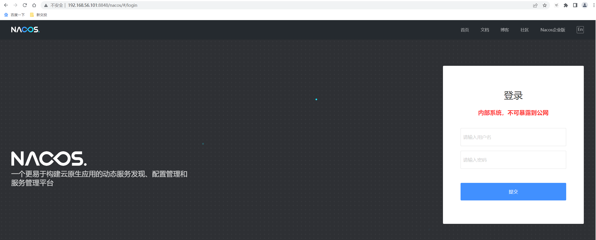
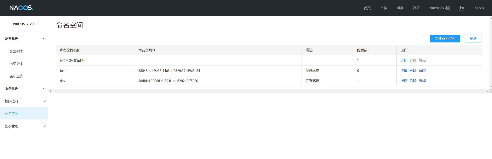
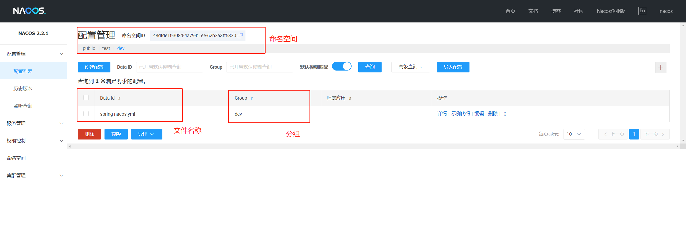
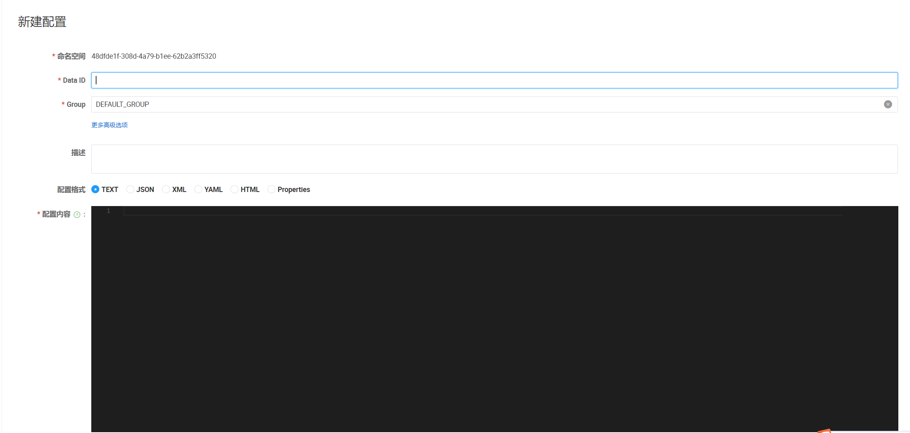

# nacos配置管理教程

在[nacos安装教程](./nacos安装教程.md)中我们介绍了如何部署nacos的集群模式以及单点部署，这篇文章主要介绍在nacos配置中的一些基本概念以及对配置文件的部署。

## 1. 登录nacos

我是将nacos-server部署在本地的虚拟机环境中，访问地址为`192.168.56.101:8848`, 在配置管理中我没有对端口进行修改，因此使用默认端口即可。如果我们需要访问后台管理环境，则需要访问：`http://192.168.56.101:8848/nacos`，则管理界面如下：

nacos默认账号密码为：`nacos/nacos`

## 2. nacos名词

- 命名空间
  
  - 命名空间的主要用处在于环境的隔离，在日常开发中会有多种环境，为了实现环境的配置隔离，因此采用命名空间的方式。避免了在不同环境搭建不同nacos的情况

- `dataId`
  
  - 指代的是配置文件的名称，dataId由三部分组成：
    
    - `prefix`: 指代了前缀信息，一般于应用名称保持一致
    
    - `profile`: `profile`决定了配置文件在什么样的profile上生效
    
    - `fileExtension`: 文件后缀
  
  - 因此，当我们在创建一个配置文件的时候，则需要考虑这三部分信息，如果不考虑，则需要再应用程序中明确指定固定的dataId

- `group`
  
  - 配置文件分组，分组的作用在于，当我们同一份配置文件在针对不同的服务分组时可能会存在一些差异，因此可以通过分组来区分。

## 3. 创建配置

当我们在创建配置文件的时候，则需要先选择命名空间，在nacos默认保留了public的命名空间，不能做删除操作。

在创建配置的时候，则需要填入对应的dataId、分组、配置格式、具体配置内容等信息，当我们填写完成后，则点击确定即可。配置文件就创建完成，就可以通过客户端的方式获取配置。
