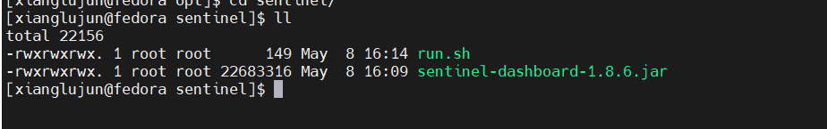

# sentinel dashboard部署方式

sentinel提供了dashboard应用程序，可供我们查看接口的调用情况，以及规则配置等内容。以下主要查看dashboard部署方式。

## 下载部署包

部署包放在github上，则对应的下载地址为：[下载relaease界面](https://github.com/alibaba/Sentinel/releases)

## 部署dashboard

当我们下载完成dashboard.jar包之后，可以将该包进行部署。

> 我的是部署在虚拟机里的，因此需要将jar包上传到虚拟机

则我对应的目录结构如下：



### 创建启动文件

```shell
touch run.sh
chmod -R 777 ./
vi run.sh
```

编辑run.sh文件之后，则可以在文件中输入以下信息:

```shell
!#/bin/bash
java -Dserver.port=8080 -Dcsp.sentinel.dashboard.server=localhost:8080 -Dproject.name=sentinel-dashboard -jar sentinel-dashboard-1.8.6.jar
```

启动dashboard的时候，很多参数都是由默认值的，部分参数列表如下：

- `csp.sentinel.dashboard.server=consoleIp:port`：用于指定控制台的ip和端口号

- `csp.sentinel.api.port=xxxx`：用于指定客户端监控的端口(默认为8719)

### 配置application.properties

在以上启动中，启动参数主要通过命令行参数来完成，因此命令行参数就显的很长，因此我们可以通过新增applicaion.properties文件来完成参数配置：

```properties
csp.sentinel.dashboard.server=localhost:8080
csp.sentinel.api.port=8719
project.name=sentinel-dashboard
```

在启动的时候，就不要额外的命令行参数:

```shell
java -jar sentinel-dashboard-1.8.6.jar
```

> 该控制台本身就是spring打包，所以会自动加载application.properties文件
