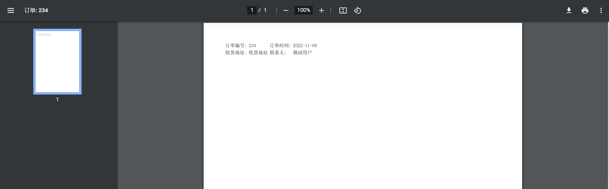

# 生成pdf并预览pdf

最近在做项目，有个需求为根据订单的详情生成pdf并能够支持pdf的预览功能。为了能够简单的实现功能，就使用了浏览器自带的预览pdf功能实现。

## 环境准备

具体的环境如下:

- jdk 8

- maven 3.6.3

- idea

## pom 依赖

为了能够快速的启动项目，则使用spring-boot作为依赖，则对应的pom文件如下:

```xml
<properties>
        <maven.compiler.source>8</maven.compiler.source>
        <maven.compiler.target>8</maven.compiler.target>
    </properties>

    <dependencyManagement>
        <dependencies>
            <dependency>
                <groupId>org.springframework.boot</groupId>
                <artifactId>spring-boot-dependencies</artifactId>
                <version>2.3.3.RELEASE</version>
                <type>pom</type>
                <scope>import</scope>
            </dependency>
        </dependencies>
    </dependencyManagement>

    <dependencies>
        <dependency>
            <groupId>org.springframework.boot</groupId>
            <artifactId>spring-boot-autoconfigure</artifactId>
        </dependency>
        <dependency>
            <groupId>org.springframework.boot</groupId>
            <artifactId>spring-boot-starter-web</artifactId>
        </dependency>
        <dependency>
            <groupId>org.springframework.boot</groupId>
            <artifactId>spring-boot-starter-aop</artifactId>
        </dependency>
        <dependency>
            <groupId>org.springframework.boot</groupId>
            <artifactId>spring-boot-starter-freemarker</artifactId>
        </dependency>

        <dependency>
            <groupId>org.xhtmlrenderer</groupId>
            <artifactId>flying-saucer-pdf-openpdf</artifactId>
            <version>9.1.20</version>
        </dependency>

        <dependency>
            <groupId>org.springframework.boot</groupId>
            <artifactId>spring-boot</artifactId>
        </dependency>

        <dependency>
            <groupId>org.projectlombok</groupId>
            <artifactId>lombok</artifactId>
            <version>1.18.22</version>
        </dependency>

        <dependency>
            <groupId>cn.hutool</groupId>
            <artifactId>hutool-core</artifactId>
            <version>5.8.9</version>
        </dependency>
    </dependencies>
```

## 相关配置

在实例中主要使用了以下框架:

- freemarker用于生成html文本

- flying-saucer-pdf-openpdf 用于生成pdf文档

### freemarker

freemarker主要配置了模板的路径信息，主要配置如下:

```yml
spring:
  freemarker:
    enabled: true
    template-loader-path: classpath:/templates/
```

在对应的订单详情生成模板:

```html
<html>
<head>
    <title>${title}</title>
    <style>
        body {
            MARGIN: AUTO;
            width: 690px;
            font-size: 12px;
            font-family: SimSun;
            color: #222;
        }
    </style>
</head>
<body>
<table>
    <tbody>
    <tr>
        <td>订单编号:</td>
        <td>${orderNo}</td>
        <td>订单时间:</td>
        <td>${orderDate}</td>
    </tr>
    <tr>
        <td>收货地址:</td>
        <td>${address}</td>
        <td>联系人:</td>
        <td>${userName}</td>
    </tr>
    </tbody>
</table>
</body>
</html>
```

## 业务逻辑

### 业务实体Order

order中主要定义了订单相关信息，

```java
package org.spring.learn.pdf.entity;

import lombok.Builder;
import lombok.Data;

@Data
@Builder
public class Order {

    private String orderNo;
    private String title;
    private String userName;
    private String address;
    private String orderDate;
}

```

### 业务逻辑

业务逻辑主要根据订单相关信息填充模板，并生成html, 并根据html生成对应的pdf信息，则对应业务代码如下;

```java
package org.spring.learn.pdf.service;

import cn.hutool.core.date.DateUtil;
import cn.hutool.core.lang.UUID;
import com.lowagie.text.pdf.BaseFont;
import freemarker.template.Configuration;
import freemarker.template.Template;
import freemarker.template.TemplateException;
import org.spring.learn.pdf.entity.Order;
import org.spring.learn.pdf.util.StreamUtil;
import org.springframework.stereotype.Service;
import org.xhtmlrenderer.layout.SharedContext;
import org.xhtmlrenderer.pdf.ITextFontResolver;
import org.xhtmlrenderer.pdf.ITextRenderer;

import java.io.*;
import java.util.Date;

@Service
public class OrderService {

    public static final String ORDER_TPL = "order.ftl";

    private Configuration configuration;

    public OrderService(Configuration configuration) {
        this.configuration = configuration;
    }

    public File previewPdf(String orderNo) throws IOException, TemplateException {
        // 模拟创建订单
        Order order = Order.builder()
                .orderDate(DateUtil.formatDate(new Date()))
                .orderNo(orderNo)
                .title("订单: " + orderNo)
                .address("收货地址")
                .userName("测试用户")
                .build();

        // 写出pdf到临时文件
        String pathPrefix = OrderService.class.getResource("/").getPath();
        String filePath = pathPrefix + File.separator + "/temp/" + UUID.randomUUID().toString() + ".pdf";
        File file = new File(filePath);

        if (!file.getParentFile().exists()) {
            file.getParentFile().mkdirs();
        }

        FileOutputStream fios = new FileOutputStream(file);

        ByteArrayOutputStream baos = new ByteArrayOutputStream();

        Template template = configuration.getTemplate(ORDER_TPL);
        template.process(order, new OutputStreamWriter(baos));

        // 获取html信息
        String htmlStr = new String(baos.toByteArray());

        // 将html转转为pdf
        ITextRenderer iTextRenderer = new ITextRenderer();

        SharedContext sharedContext = iTextRenderer.getSharedContext();
        sharedContext.setPrint(true);
        sharedContext.setInteractive(false);

        ITextFontResolver fontResolver = iTextRenderer.getFontResolver();
        String fontPath = OrderService.class.getResource("/simsun.ttc").getPath();
        fontResolver.addFont(fontPath, BaseFont.IDENTITY_H, BaseFont.NOT_EMBEDDED);

        iTextRenderer.setDocumentFromString(htmlStr);
        iTextRenderer.layout();
        // 写出
        iTextRenderer.createPDF(fios);

        StreamUtil.close(fios);
        return file;
    }
}

```

### Controller实现

Controller主要接收请求，写出数据，则对应代码如下：

```java
package org.spring.learn.pdf.controller;

import lombok.extern.slf4j.Slf4j;
import org.spring.learn.pdf.service.OrderService;
import org.spring.learn.pdf.util.StreamUtil;
import org.springframework.web.bind.annotation.GetMapping;
import org.springframework.web.bind.annotation.PathVariable;
import org.springframework.web.bind.annotation.RequestMapping;
import org.springframework.web.bind.annotation.RestController;

import javax.servlet.http.HttpServletResponse;
import java.io.File;
import java.io.FileInputStream;
import java.nio.channels.Channels;
import java.nio.channels.FileChannel;

@Slf4j
@RestController
@RequestMapping("/order")
public class OrderPdfPreviewController {

    private OrderService orderService;

    public OrderPdfPreviewController(OrderService orderService) {
        this.orderService = orderService;
    }

    @GetMapping("/pdf/preview/{orderNo}")
    public void previewPdf(@PathVariable("orderNo") String orderNo, HttpServletResponse response) {
        FileInputStream fis = null;
        try {
            File f = orderService.previewPdf(orderNo);

            response.setContentType("application/pdf");
            // 获取文件输入流
            fis = new FileInputStream(f);
            FileChannel fileChannel = fis.getChannel();
            fileChannel.transferTo(0, fileChannel.size(), Channels.newChannel(response.getOutputStream()));
        } catch (Exception e) {
            log.error("previewPdf: 预览pdf失败, 原因: {}", e.getMessage(), e);
        } finally {
            StreamUtil.close(fis);
        }
    }
}

```

## 启动类

spring-boot启动类如下:

```java
package org.spring.learn.pdf;

import org.springframework.boot.SpringApplication;
import org.springframework.boot.autoconfigure.SpringBootApplication;

@SpringBootApplication
public class PdfApplication {

    public static void main(String[] args) {
        SpringApplication.run(PdfApplication.class, args);
    }
}

```

我们启动后端的服务，并访问`http://localhost:8080/order/pdf/preview/234`, 则可以看到浏览器打开了pdf文档，如图:



则pdf对应的预览功能实现。

## 问题

### 1. 默认生成pdf中文不展示

这个是因为`flying-saucer-pdf-openpdf`默认不支持中文，需要我们用自己的字体替代，我们可以在`C:/windows/fonts`中选择`宋体`，并拷贝到项目的resources中，则可以通过代码的方式加入的框架，并在html中使用字体即可。

在代码中可以加入如下代码:

```java
ITextFontResolver fontResolver = iTextRenderer.getFontResolver();
        String fontPath = OrderService.class.getResource("/simsun.ttc").getPath();
        fontResolver.addFont(fontPath, BaseFont.IDENTITY_H, BaseFont.NOT_EMBEDDED);
```

在html模板中使用引入的字体，字体需要区分大小写:

```html

```
