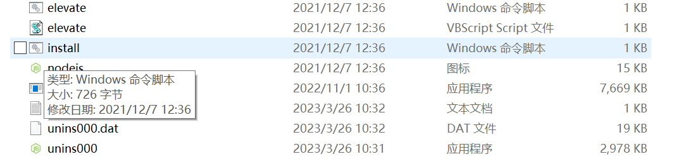
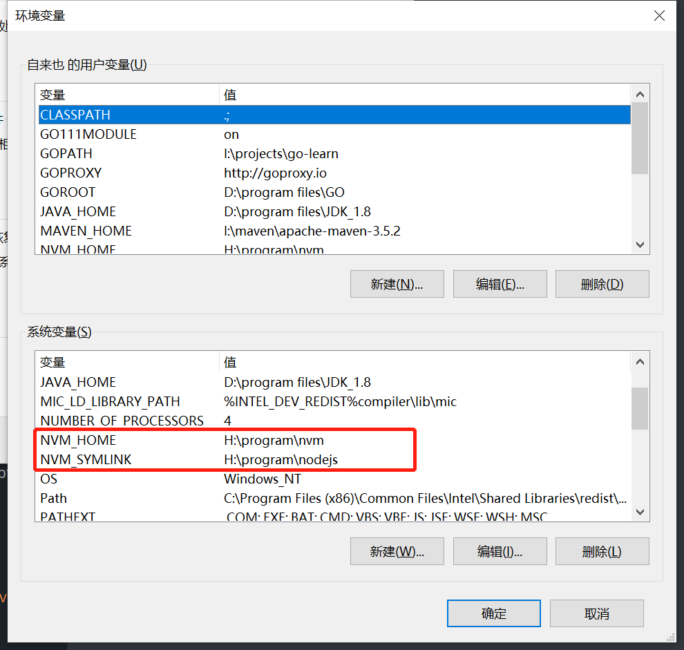

# nvm 安装教程(windows)

## 一、安装版

### 1. 事前准备

在开始安装nvm之前，需要先将电脑中已经存在的nodejs版本删除干净，包括：

- nodejs安装程序

- NODE_PATH环境变量

- Path中关于nodejs得路径配置信息

### 2. 下载nvm-windows

在windows中有多种可以实现nvm功能得程序，这里主要介绍nvm-windows得使用，主要是是因为比较符合每个平台得使用命令得统一。[下载地址](https://github.com/coreybutler/nvm-windows)

### 3. 安装nvm-windows

下载下来其实是一个安装板得程序，只需要按照步骤来安装就可以了，具体安装后的目录如下:



通过安装的方式，在环境变量中会自动的添加以下信息:



- NVM_HOME: 指代了nvm安装目录

- NVM_SYMLINK: 是一个软连接得目录，当通过nvm切换nodejs版本的时候，这个目录会发生一些变化

- Path：path中的内容最终也会只想这两个目录，这样我们就能够在控制台直接使用命令

### 4. 常用命令

```shell
# 安装最近得nodejs版本
nvm install latest

# 安装最近得lts版本
nvm install lts

#当前nodejs版本
nvm current

# 已经安装的nodejs版本
nvm list

#使用指定版本得nodejs
nvm use xx.xx.xx
```

## 二、nvm-windows绿色安装版

绿色安装对于安装版来说主要是环境变量和配置得相关信息需要自己手动得去配置，因此会稍显得有点麻烦。

### 1. 下载zip包

下载方式和安装包得下载方式一致，只是下载得文件有些差别而已。[nvm-noinstall.zip](https://github.com/coreybutler/nvm-windows)

### 2. 解压文件并配置环境变量

- 将zip压缩包解压到对应得目录，例如：`h:/program/nvm`

- 在环境变脸中新增`NVM_HOME`变量，值为`h:/program/nvm`

- 在环境变量中新增`NVM_SYMLINK`变量，值为`h:/program/nodejs`

- 修改path变量，并加入`%NVM_HOME%`和`%NVM_SYMLINK%`两个值

> 在使用`NVM_SYMLINK`变量得时候，需要注意，该目录得地址主要用于标记当前正在使用得nodejs得版本，该目录最好是不存在。如果已经存在目录，对应目录得内容也不会删除。

### 3. settings.txt文件

改文件作为nvm得一个简单配置文件，该文件放在`NVM_HOME`得目录下，和安装文件放在一起，该文件中主要包含了四个内容：

- root: 该配置主要用于标记nvm得安装的根目录，这只指代`NVM_HOME`

- path: 该配置主要用于标记软连接得路径，指代了`NVM_SYMLINK`

- proxy：当不需要使用代理得时候，直接设置为`none`. 该值能够通过nvm命令行参数修改

- arch: 这个主要指代了系统得架构，是属于32位或者64位。

因此，一个完整得settings.txt文件，看起来像这样的:

```textile
root: H:\program\nvm
path: H:\program\nodejs

```

在完成了上面得步骤之后，那么我们就可以通过命令行得方式验证安装的情况
