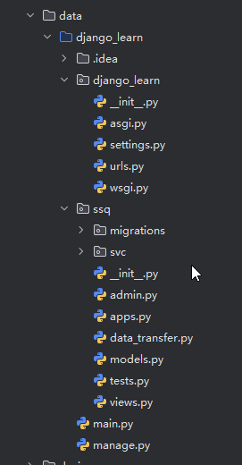
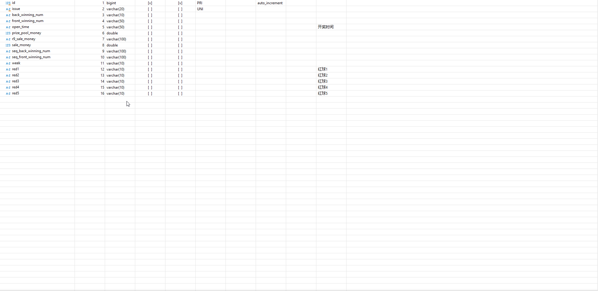
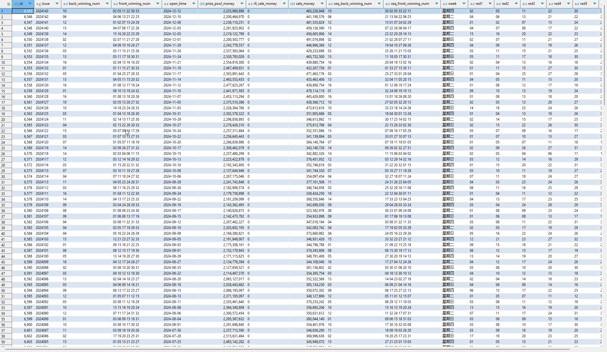

# 如何单独使用django orm框架

最近在学习python语言，然后自己用python写一些小的程序，然后从各个网站爬取一些数据，并把这些数据存放在mysql数据库中，然后又不想自己写sql， 因此了解到django中有orm的模块，但是django又必须在web项目中使用，但是我又不想运行web项目，因此考虑将orm框架提出来，单独能够操作数据库使用。

## requirements.txt

这个文件主要是维护了项目依赖的三方框架和对应的版本，我的依赖版本如下：

```python
requests~=2.32.3
Django==5.1.4
pymysql==1.1.1
mysqlclient==2.2.6
```

## 使用django创建项目目录和模块

```python
python -m django startproject django_learn
# 创建model
python -m django startapp ssq
```

> 不要关系ssq这个代表什么意思，主要是学习知识的吧，所以不要在意这些小细节

创建完成之后，我们可以看到如下的项目目录结构：



## main.py

这个文件就是程序的主要入口，在程序启动的时候，就主要放置一些django的初始化程序，然后其他的和使用django一样的，我的代码如下：

```python
import os

os.environ.setdefault('DJANGO_SETTINGS_MODULE', 'django_learn.settings')
os.environ["DJANGO_ALLOW_ASYNC_UNSAFE"] = "true"
# django.setup()

from django.core.wsgi import get_wsgi_application
application = get_wsgi_application()

from ssq.svc.sync_ssq_data import sync_ssq_data
print("_________init_________执行")

if __name__ == '__main__':
    sync_ssq_data()
```

- 这里设置了`DJANGO_SETTING_MODULE`变量，主要是为了方便django读取，如果不想使用变量，也可以使用`django.configure()`方法，里面传入的是一个json

- `get_wsgi_application()`这个一定要调用，这里面主要实现了django的初始化的一些操作，不执行的话，会出现`django.core.exceptions.AppRegistryNotReady: Apps aren't loaded yet.`的错误

- `django.setup()`这个方法调用被注释掉了，是因为`get_wsgi_application()`中被调用了，如果这里放开，会出现`lock not reetrant`的错误，表明了锁不是重入锁，不能重复调用

> 我单独使用的时候，我保留了django的默认目录结构，方便使用和django保持一致

## models

其次就是定义model了，这个和使用django是一样的，可以创建如下的models:

```python
from django.db import models

# Create your models here.
class Ssq(models.Model):
    # 开奖的期号
    issue = models.CharField(max_length=20, db_comment='开奖的期号',db_column="issue",  null=True, unique=True)
    # 黑球号码
    backWinningNum = models.CharField(max_length=10, db_comment='黑球号码', db_column="back_winning_num",  null=True)

    # 红球开奖号码
    frontWinningNum = models.CharField(max_length=50, db_comment='红球开奖号码', db_column="front_winning_num",  null=True)

    # 开奖时间
    openTime = models.CharField(db_comment='开奖时间', db_column="open_time",  null=True, max_length=50)

    # 奖池金额
    prizePoolMoney = models.FloatField(db_comment='奖池金额', db_column="prize_pool_money",  null=True)

    r9SaleMoney = models.CharField(max_length=100, db_comment='销售金额', db_column="r9_sale_money",  null=True)

    # 销售金额
    saleMoney = models.FloatField(db_comment='销售金额', db_column="sale_money",  null=True)

    seqBackWinningNum = models.CharField(max_length=100, db_comment='黑球号码', db_column="seq_back_winning_num",  null=True)

    seqFrontWinningNum = models.CharField(max_length=100, db_comment='红球号码', db_column="seq_front_winning_num",  null=True)

    week = models.CharField(max_length=10,db_comment='星期', db_column="week",  null=True)

    red1 = models.CharField(max_length=10, db_comment='红球1', db_column="red1",  null=True)
    red2 = models.CharField(max_length=10, db_comment='红球2', db_column="red2",  null=True)
    red3 = models.CharField(max_length=10, db_comment='红球3', db_column="red3",  null=True)
    red4 = models.CharField(max_length=10, db_comment='红球4', db_column="red4",  null=True)
    red5 = models.CharField(max_length=10, db_comment='红球5', db_column="red5",  null=True)
    red6 = models.CharField(max_length=10, db_comment='红球6', db_column="red6",  null=True)


class BaseBetWinner(models.Model):
    # 奖金
    awardMoney = models.FloatField(db_comment='奖金', db_column="award_money", default=0.0,  null=True)

    # 购买数量
    awardNum = models.IntegerField(db_comment='购买数量', db_column="award_num", default=0,  null=True)

    # 备注
    remark = models.CharField(max_length=100, db_comment='备注', db_column="remark",  null=True)

    # 总金额
    totalMoney = models.FloatField(db_comment='总金额', db_column="total_money", default=0.0,  null=True)

    # 中奖等级
    awardEtc = models.CharField(max_length=100, db_comment='奖项信息', db_column="award_etc",  null=True)

    # 创建表关联
    ssq = models.ForeignKey('Ssq', on_delete=models.CASCADE, db_column="ssq_id", default= None,  null=True)

```

## 根据models创建数据库结构

有了models的结构，我们就可以根据module创建数据库结构了，具体命令如下：

```python
# 标记变更
python manage.py makemigrations ssq
# 执行变更
python manage.py migrate ssq
```



## 执行数据库操作

在有了以上的步骤之后，我们就可以单独使用django orm框架操作数据库了，我这边执行成功了。



大家有兴趣快去试一下吧!!
