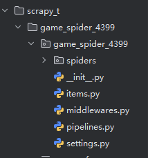
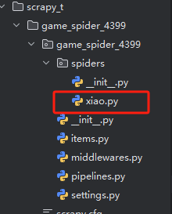
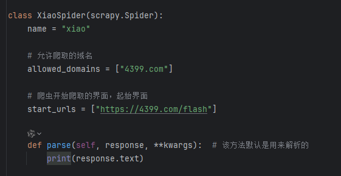
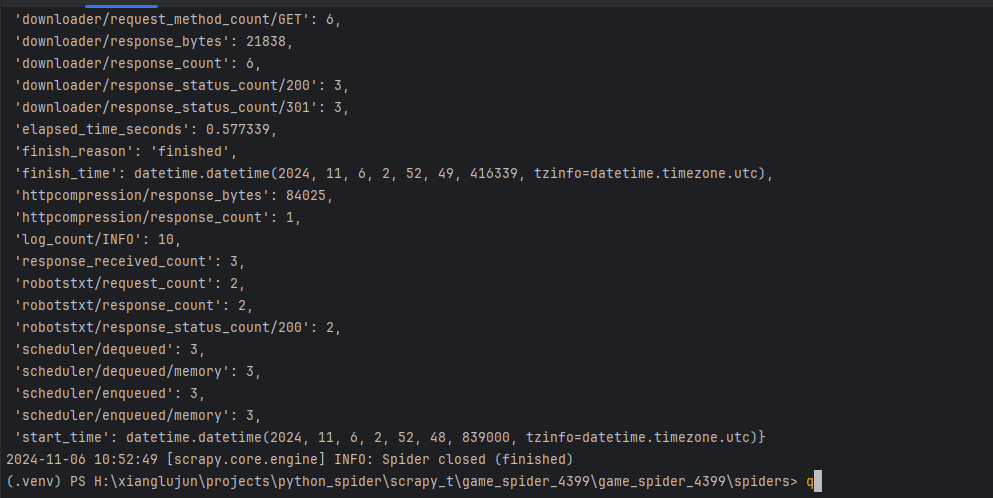
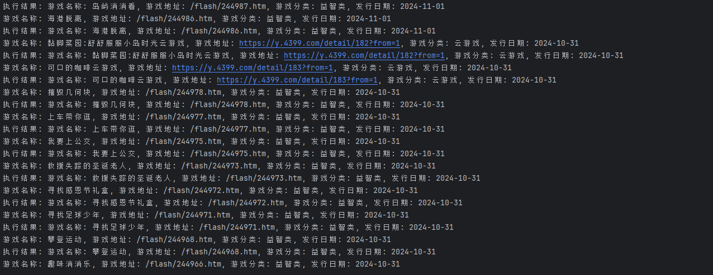

# scrapy的简单demo

## 安装scrapy

```python
pip install scrapy
```

> 在windows上面可能安装会有问题，这时就需要单独的安装每个依赖包。

## 创建scrapy项目

```python
scrapy startproject demo
```

通过这个命令，将会生成一个文件夹，其中包含了scrapy的项目工程结构，已经初始化的配置信息，则具体信息如下：



其中必要的文件的说明：

1. spiders文件夹：这里面主要是存放爬虫的具体代码实现

2. items: 则是用于数据的存放

3. middlewares: 则是中间件的使用

4. pipelines: 是管道的实现

5. settings: 是配置文件

## 创建第一个爬虫程序

创建爬虫程序可以使用scrapy提供的创建命令：

```python
scrapy genspider xiao 4399.com
```

- 第一个参数 xiao: 则是爬虫的名称

- `4399.com`则是限定了爬虫的爬取范围，毕竟网站有一些外部的链接地址，可以防止爬取到不必要的内容

通过以上命令之后，我们将可以在spiders下看到对应的程序代码：



因此在这里面我们就可以实现具体的爬取细节。

在代码中，具体的代码如下：



- name：则表示了爬虫的名称

- allowed_domains: 则表示了当前爬虫允许爬取的域名，如果没有在这里个域名中的，则不会爬取

- start_urls: 则记录了从那个url开始爬取，也就是爬虫开始爬取的起始位置

## 启动爬虫

有了爬虫程序之后，则可以启动爬虫，启动命令如下：

```python
scrapy runspider xiao.py
```



就会看到有如下的输出，表示爬虫执行成功。

## 爬取4399小游戏信息

### 爬虫代码如下:

```python
import scrapy

from game_spider_4399.items import GameSpider4399Item


class XiaoSpider(scrapy.Spider):
    name = "xiao"

    # 允许爬取的域名
    allowed_domains = ["4399.com"]

    # 爬虫开始爬取的界面，起始界面
    start_urls = ["https://4399.com/flash"]

    def parse(self, response, **kwargs):  # 该方法默认是用来解析的
        url = response.url
        print(f"抓取到了{url}网页内容，开始解析..")
        ul = response.xpath('//*[@id="skinbody"]/div[8]/ul')
        if ul is None:
            print("没有获取到网页内容")
            return

        lis = ul[0].xpath("./li")
        for li in lis:
            item = GameSpider4399Item()
            name_a = li.xpath("./a")
            if name_a:
                name_a = name_a[0]
                item['name'] = name_a.xpath("./b/text()").extract_first()
                item['url'] = name_a.xpath("@href").extract_first()

            item['category'] = li.xpath("./em/a/text()").extract_first()
            item['date'] = li.xpath("./em/text()").extract_first()

            print(item)

            # 通过yield将数据发送到管道，然后交由管道对数据进行处理
            yield item

```

### item定义数据模型

```python
class GameSpider4399Item(scrapy.Item):
    # define the fields for your item here like:
    # name = scrapy.Field()
    name = scrapy.Field()
    url = scrapy.Field()
    category = scrapy.Field()
    date = scrapy.Field()

    def __str__(self):
        return "游戏名称: %s, 游戏地址: %s, 游戏分类: %s, 发行日期: %s" % (
        self["name"], self["url"], self["category"], self["date"])
```

### 定义pipeline管道对象，处理数据

```python
class GameSpider4399Pipeline:
    def process_item(self, item, spider):
        if isinstance(item, GameSpider4399Item):
            print(f"执行结果: {item}")
        return item
```

### 配置settings，将管道对象配置

```python
# Configure item pipelines
# See https://docs.scrapy.org/en/latest/topics/item-pipeline.html

# key: 表示了管道的路径，已经管道的名称
# value: 表示了优先级，数值越小，则优先级越高，优先执行
ITEM_PIPELINES = {
    "game_spider_4399.pipelines.GameSpider4399Pipeline": 300,
}
```

### 执行爬虫

```python
scrapy crawl xiao
```

通过执行以上代码，可以得到如下的输出:



那我们的第一个scrapy项目获取数据信息就完成啦~~~~


