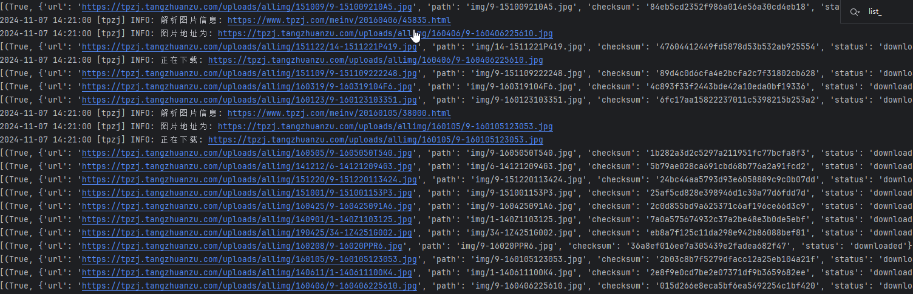

# 爬取图片之间图片并下载

## 准备工作

这段程序使用了scrapy中的CrawlSpider的实现，因此程序能够根据规则自动的获取url连接并进行跟踪下载。这里使用了ImagesPipeline的实现，该类需要安装依赖包，否则不会有任何的执行效果。

```python
pip install pillow
```

## 编写spider主程序

```python
from scrapy.spiders import CrawlSpider, Rule
from scrapy.linkextractors import LinkExtractor

from game_spider_4399.items import TpzjItem


# 抓取图片之家的图片信息
class TpzjSpider(CrawlSpider):
    name = 'tpzj'
    start_urls = ['https://www.tpzj.com/bizhi/DNmeinv/']
    rules = (
        Rule(
            LinkExtractor(allow=r'/[0-9]+.html'),
            callback='parse_item',
            follow=True
        ),
        Rule(
            LinkExtractor(allow=r'/^list_*+.html'),
            callback='parse_item',
            follow=True
        ),
    )

    # def parse_start_url(self, response, **kwargs):
    #     url = response.url
    #     self.logger.info("抓取到了界面信息: %s", url)
    #     next_page = response.xpath('//*[@id="container"]/div/div/div[3]/div/div[2]/ul/li[8]/a')
    #     if not next_page:
    #         self.logger.info("没有更多的图片信息")
    #         return None
    #     href = next_page[0].xpath('@href').get()
    #     next_page_url = response.urljoin(href)
    #     self.logger.info("下一页的url: %s", next_page_url)
    #
    #     response.follow(next_page_url, callback=self.parse_start_url)

    def parse_item(self, response):
        self.logger.info(f"解析图片信息: {response.url}")
        source_img = response.xpath('//*[@id="bigpic"]/a[1]/img')

        if not source_img:
            source_img = response.xpath('//*[@id="bigpicimg"]')

        img_src = source_img.xpath('@src').get()

        self.logger.info(f"图片地址为: {img_src}")
        # 下载图片
        item = TpzjItem()
        item['img_src'] = img_src
        yield item

```

### item实现

```python
class TpzjItem(scrapy.Item):
    img_src = scrapy.Field()
```

### pipeline实现

```python
class TpzjPipeline(ImagesPipeline):

    def process_item(self, item, spider):
        url = item['img_src']
        spider.logger.info(f"正在下载: {url}")
        if isinstance(item, TpzjItem):
            super().process_item(item, spider)

    def file_path(self, request, response=None, info=None, *, item=None):
        file_name = request.url.split('/')[-1]
        return f"img/{file_name}"

    def get_media_requests(self, item, info):
        return scrapy.Request(item['img_src'])

    def item_completed(self, results, item, info):
        print(results)
```

### settings配置

```python
# key: 表示了管道的路径，已经管道的名称
# value: 表示了优先级，数值越小，则优先级越高，优先执行
ITEM_PIPELINES = {
    "game_spider_4399.pipelines.GameSpider4399Pipeline": 300,
    "game_spider_4399.pipelines.TpzjPipeline": 299
}

IMAGES_STORE = "./images"
```

## 执行爬虫

```python
scrapy crawl tpzj
```



可以看到爬取并获取成功，则以下代码实现完成。
