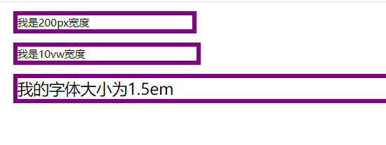
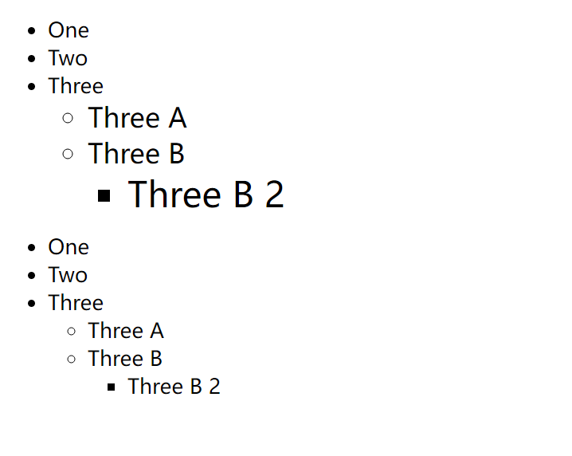
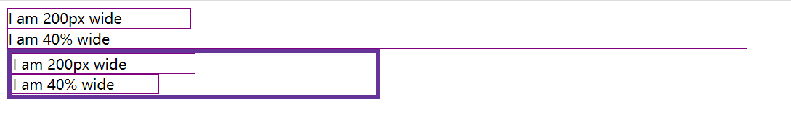

# css值与单位

## 数字、长度和百分比

以下为在css中的全部归类数值:

| 数值类型         | 描述                                                                                                                  |
| ------------ | ------------------------------------------------------------------------------------------------------------------- |
| <integer>    | 是一个整数，例如1024或者-55                                                                                                   |
| <number>     | 是一个小数，可能会有小数点后面部分，也可能没有                                                                                             |
| <dimension>  | dimension是一个<number>的数字，但是会附带单位，例如: 45deg, 5s或10px<br/>dimension是一个伞型类别，包括<length>, <angle>, <time>, <resolution>类型 |
| <percentage> | <percentage>表示一些其他值的一部分，例如 50%。百分比值总是相对于另一个量，例如，一个元素的长度相对于其父元素的长度。                                                  |

### 长度

在CSS中有多种类型的长度，分别为绝对长度以及相对长度。最重要的是知道他们之间的差别，才能够更好的控制元素的大小。

#### 绝对长度单位

以下是绝对长度单位，通常认为他们的大小与其他预算没有关系，始终保持一致的大小。

| 单位  | 名称     | 等价转换                |
| --- | ------ | ------------------- |
| cm  | 厘米     | 1cm = 96px/2.54     |
| mm  | 毫米     | 1mm = 1/10 * 1cm    |
| Q   | 四分之一毫米 | 1Q=1/40 * 1cm       |
| in  | 英寸     | 1in = 2.54cm = 96px |
| pc  | 十二点活字  | 1pc = 1/6 of 1in    |
| pt  | 点      | 1pt = 1/72 of 1in   |
| px  | 像素     | 1px = 1/96 of 1in   |

这些值大多数都是用在打印机的时候，唯一常用的值为px

#### 相对长度单位

相对长度单位指代的是相对于其他的一些东西，例如字体大小相对于父元素的字体大小。以下列出了在开发中常用的一些相对长度单位。

| 单位   | 相对于                                              |
| ---- | ------------------------------------------------ |
| em   | 在font-size中相对于父元素的字体大小。在其他属性中，相对于自身字体的大小。例如width |
| ex   | 字符x的高度                                           |
| ch   | 数字0的宽度                                           |
| rem  | 根元素字体大小                                          |
| lh   | 元素的line-height                                   |
| vw   | 视窗宽度的1%                                          |
| vh   | 视窗高度的1%                                          |
| vmin | 视窗较小尺寸的1%                                        |
| vmax | 视窗大尺寸的1%                                         |

以下示例中，包含了包含了对绝对单位长度和相对单位长度的使用

```html
<!DOCTYPE html>
<html lang="en">
  <head>
    <meta charset="UTF-8" />
    <meta http-equiv="X-UA-Compatible" content="IE=edge" />
    <meta name="viewport" content="width=device-width, initial-scale=1.0" />
    <title>相对单位长度</title>
    <style>
      .wrapper {
        font-size: 12px;
      }

      .px {
        width: 200px;
      }

      .vm {
        width: 10vw;
      }

      .em {
        font-size: 1.5em;
      }

      .box {
        border: 5px solid purple;
        margin: 10px;
      }
    </style>
  </head>
  <body>
    <div class="wrapper">
      <div class="px box">我是200px宽度</div>
      <div class="vm box">我是10vw宽度</div>
      <div class="em box">我的字体大小为1.5em</div>
    </div>
  </body>
</html>
```

- 在第一个div中，因为是设置固定的宽度，因此div的宽度是固定的，不会发生变化

- 在第二个div中，设置了单位vm，会根据浏览器窗口的变动改变大小

- 在第三个div中，因为em单位是针对的字体的大小，因此第三个div中的字体大小明显会比其他div中的字体大。



#### ems和rems相对单位

em的计算方式是以父元素的字体大小作为参考，因此当在嵌套元素中使用`1.5em`这样的设置时，字体会随着嵌套的深度不断变大。

而rem参考的则是根节点，也就是html节点，因此并不会出现以上的情况。

例如以下示例

```html
<!DOCTYPE html>
<html lang="en">
  <head>
    <meta charset="UTF-8" />
    <meta http-equiv="X-UA-Compatible" content="IE=edge" />
    <meta name="viewport" content="width=device-width, initial-scale=1.0" />
    <title>rem与em的区别</title>
    <style>
      html {
        font-size: 16px;
      }

      .ems li {
        font-size: 1.3em;
      }

      .rems li {
        font-size: 1.3rem;
      }
    </style>
  </head>
  <body>
    <ul class="ems">
      <li>One</li>
      <li>Two</li>
      <li>
        Three
        <ul>
          <li>Three A</li>
          <li>
            Three B
            <ul>
              <li>Three B 2</li>
            </ul>
          </li>
        </ul>
      </li>
    </ul>

    <ul class="rems">
      <li>One</li>
      <li>Two</li>
      <li>
        Three
        <ul>
          <li>Three A</li>
          <li>
            Three B
            <ul>
              <li>Three B 2</li>
            </ul>
          </li>
        </ul>
      </li>
    </ul>
  </body>
</html>
```

则最终的展示结果为：



#### 百分比取值

在多数情况下，百分比和长度的取值是一样的。但是百分比的取值回去参考其他元素的设置。例如在一下的实例中，由于参考的元素不一样，会导致最终呈现的结果也有一定的差别.

```html
<!DOCTYPE html>
<html lang="en">
  <head>
    <meta charset="UTF-8" />
    <meta http-equiv="X-UA-Compatible" content="IE=edge" />
    <meta name="viewport" content="width=device-width, initial-scale=1.0" />
    <title>百分比取值</title>
    <style>
      .wrapper {
        width: 400px;
        border: 5px solid rebeccapurple;
      }

      .px {
        width: 200px;
      }

      .percent {
        width: 40%;
      }

      .box {
        border: 1px solid purple;
      }
    </style>
  </head>
  <body>
    <div class="box px">I am 200px wide</div>
    <div class="box percent">I am 40% wide</div>
    <div class="wrapper">
      <div class="box px">I am 200px wide</div>
      <div class="box percent">I am 40% wide</div>
    </div>
  </body>
</html>
```

则最终的呈现结果为，



#### 数字

数字的意思则是在设置属性的时候，不带有参数，例如设置透明度的`opacity`。

## 颜色

在css中，设置颜色值的方法有很多中，以下就探讨设置颜色的方式。

### 关键字设置

关键字则是表示颜色的英文名称，代表了各种的颜色。例如: red, blue, green.

### 十六进制的RGB值

十六进制表示的颜色信息

```css
.three {
  background-color: #128a7d;
}
```

### RGB和RGBA值

- RGB是一个函数，函数中包含了三个参数，分别代表红色，绿色和蓝色。与16进制的值非常相似。不过rgb的值并不是由字符表示，而是0~255之间的数值表示。

- RGBA也是使用RGB的参数值来设置颜色，只是多了一个参数，用于控制颜色的透明度，当值为0的时候，表示完全透明。当为1时，表示完全不透明。因此介于0~1的数来控制透明度。

rgb的值设置方式如下:

```css
.three {
  background-color: rgb(18, 138, 125);
}
```

rgba的值设置方式如下：

```css
.three {
  background-color: rgba(18, 138, 125, .9);
}
```

### HSL和HSLA的值

与RGB的表达方式的不同，hsl()表示的是色调，饱和度和亮度值作为参考。这些值的不同组合，可以表示1670万中颜色。

> hsl的值在浏览器中支持的并不是很好，在老版本的IE中是完全不支持的。

- 色调：颜色的底色。这个值在0~360之间，表示色轮周围的角度

- 饱和度：颜色有多饱和？他的取值在0~100%，其中0表示无色，而100%表示全饱和度

- 亮度：颜色有多亮？它从0~100%取值，其中0表示没有光，100%表示完全亮

```css
.three {
  background-color: hsla(174, 77%, 31%);
}

.three {
  background-color: hsla(174, 77%, 31%, .9);
}
```
