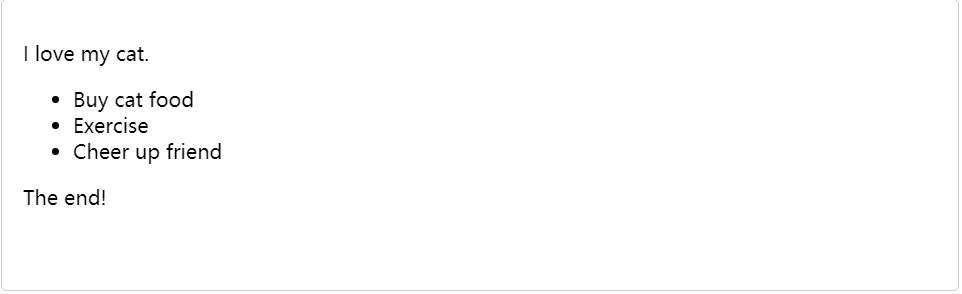
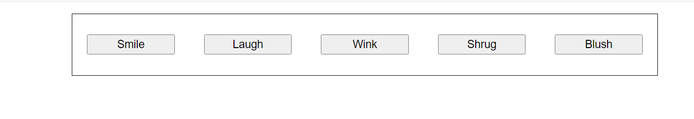

# css布局

## 定位

<table>
        <thead>
            <tr>
                <th>个数</th>
                <th>书写语法</th>
                <th>说明</th>
                <th>文档流</th>
                <th>偏移位置（top left right bottom）时候的参照物</th>
                <th>层叠顺序(z-index)</td>
            </tr>
        </thead>
        <tbody>
            <tr>
                <td>1</td>
                <td>position: static</td>
                <td>默认值</td>
                <td>默认</td>
                <td>默认值</td>
                <td rowspan="5">
                    z-index属性是不带单位的，并且可以给负值，没有设置z-index时，最后写的对象优先在上层，设置后，数值越大，层越靠上
                </td>
            </tr>
            <tr>
                <td>2</td>
                <td>position: absolute;</td>
                <td>绝对定位</td>
                <td>脱离</td>
                <td>A) 当没有父元素或者父元素没有定位，参照物是浏览器窗口的第一屏<br/>
                B) 有父元素且父元素有定位，参照父元素</td>
            </tr>
            <tr>
                <td>3</td>
                <td>position: relative;</td>
                <td>相对定位</td>
                <td>不脱离</td>
                <td>自己初始位置</td>
            </tr>
            <tr>
                <td>2</td>
                <td>position: fixed;</td>
                <td>固定定位</td>
                <td>脱离</td>
                <td>浏览器的当前窗口</td>
            </tr>
            <tr>
                <td>2</td>
                <td>position: sticky;</td>
                <td>粘性定位</td>
                <td colspan="3">可以做吸顶效果，粘性定位是CSS3.0新增加的，兼容不好</td>
            </tr>
        </tbody>
    </table>


## 正常布局流

正常布局流指代的是对html元素不做任何的控制，以html浏览器默认的布局方式展示。

```html
<p>I love my cat.</p>

<ul>
  <li>Buy cat food</li>
  <li>Exercise</li>
  <li>Cheer up friend</li>
</ul>

<p>The end!</p>
```

则以上的元素，最终的展示方式为:



默认的，一个[块级元素](https://developer.mozilla.org/zh-CN/docs/Web/HTML/Block-level_elements)的内容宽度是其父元素的 100%，其高度与其内容高度一致。[内联元素](https://developer.mozilla.org/zh-CN/docs/Web/HTML/Inline_elements)的 height width 与内容一致。你无法设置内联元素的 height width --- 它们就那样置于块级元素的内容里。如果你想控制内联元素的尺寸，你需要为元素设置`display: block;` （或者，`display: inline-block;` inline-block 混合了 inline 和 block 的特性。)

这样解释了独立元素的布局，但是元素之间又是如何相互影响的呢？正常布局流（在布局介绍里提到过）是一套在浏览器视口内放置、组织元素的系统。默认的，块级元素按照基于其父元素的[书写顺序](https://developer.mozilla.org/zh-CN/docs/Web/CSS/writing-mode)(*默认值：* horizontal-tb) 的*块流动方向 (block flow direction)*放置 --- 每个块级元素会在上一个元素下面另起一行，它们会被设置好的 margin 分隔。在英语，或者其他水平书写、自上而下模式里，块级元素是垂直组织的。

内联元素的表现有所不同 --- 它们不会另起一行；只要在其父级块级元素的宽度内有足够的空间，它们与其他内联元素、相邻的文本内容（或者被包裹的）被安排在同一行。如果空间不够，溢出的文本或元素将移到新的一行。

如果两个相邻的元素都设置了 margin 并且两个 margin 有重叠，那么更大的设置会被保留，小的则会消失 --- 这被称为外边距叠加，我们之前见到过。

## 弹性盒子

弹性盒子是一种按照行和列布局元素的以为布局方法。元素可以膨胀以填充额外的空间，收缩以适应更小的空间。

### 为什么使用弹性盒子？

在之前的版本中，为了能够更好的实现布局的实现，一般会使用float和position实现布局，但是这种方式不能很快的实现以下场景：

- 在父内容中垂直居中一个块内容

- 使容器的所有子项占用等量的宽度/高度，而不管有多少宽度或者高度可用

- 使多列布局中的所有都使用相同的高度，即使他们包含的内容量不相同

### flex模型说明

当采用flex布局的时候，主要围绕两个轴来进行布局：


- 主轴(main axis)是沿着flex元素放置的方向延伸的轴，（比如页面上横向的行，纵向的列），该轴的开始和结束称之为`main start`和`main end`

- 交叉轴(cross axis): 是垂直与flex方向防止的轴。该轴的开始和结束称之为`cross start` 和`cross end`

- 设置了`display:flex`的父元素被称之为flex容器

- 在flex容器中表现为弹性的盒子成为flex的项

### 列还是行

flex中控制主轴的方法，则是通过`flex-direction`进行控制，默认值为`row`, 我们也可以更改，例如

```css
.container {
    flex-direction: column;
}
```

### 换行

当我们在定高和定宽的布局中，如果flex中的元素比较多的时候，这个时候flex项将会产生溢出，如果我们需要解决这个问题，因此我们需要在flex容器中加入样式：

```css
.container {
    flex-wrap: wrap;
}
```

同时也需要将规则使用到flex项中，并在flex项中加入样式：

```css
.item {
    flex: 20%;
}
```

在以上配置中，将会有以下的现象:

- 在一行中会足够多的放入flex选项，但是当一行内容溢出的时候，会自动换行

- `flex: 20%`的声明则是表示，每一个flex的项最少的宽度为20%的宽度

- 当最后一行不足列的数量时，flex选项会占满整行

### flex-flow的缩写

flex-flow是flex-direction和flex-wrap的合并的写法，例如

```css
flex-direction: row;
flex-wrap: wrap;
```

则合并写法为：

```css
flex-flow: row wrap;
```

### flex的动态尺寸

在设置flex项的尺寸的时候，我们能够设置flex的宽度能够带有带有，也可以不带有单位，例如：

```css
article {
    flex: 1;
}
```

这个配置表示了每个flex项的宽度都是相等的。占用的剩余空间需要减去padding和margin的空间，因为这样设置值的时候，表示得是一个比例。

我们同时也可以为每个flex项设置不同的比例值，例如：

```css
article:nth-of-type(3) {
  flex: 2;
}
```

这就代表了，在第三个article元素的宽度会比其他的flex项宽2倍。

除此之外，也可以同时为flex选项设置最小的宽度，例如：

```css
article {
    flex: 1 200px;
}
```

在以上的配置，就表示`每个flex先流程200px的宽度，然后剩余的空间根据比例进行共享分配。`

> 弹性盒子真正的用途在于它的灵活性和响应性。在你调整浏览器的窗口或者增加article元素的时候，布局依然是好的。

### flex样式的缩写与全写

[`flex`](https://developer.mozilla.org/zh-CN/docs/Web/CSS/flex) 是一个可以指定最多三个不同值的缩写属性：

- 第一个就是上面所讨论过的无单位比例。可以单独指定全写 [`flex-grow`](https://developer.mozilla.org/zh-CN/docs/Web/CSS/flex-grow) 属性的值。
- 第二个无单位比例——[`flex-shrink`](https://developer.mozilla.org/zh-CN/docs/Web/CSS/flex-shrink)——一般用于溢出容器的 flex 项。这指定了从每个 flex 项中取出多少溢出量，以阻止它们溢出它们的容器。
- 第三个是上面讨论的最小值。可以单独指定全写 [`flex-basis`](https://developer.mozilla.org/zh-CN/docs/Web/CSS/flex-basis) 属性的值。

### 水平和垂直对齐

我们可以通过样式的设置，让flex选项按照主轴或者交叉轴对齐。

例如有如下html界面:

```html
<!DOCTYPE html>
<html lang="en-us">
  <head>
    <meta charset="utf-8" />
    <meta name="viewport" content="width=device-width" />
    <title>Flexbox align 0 — starting code</title>
    <style>
      html {
        font-family: sans-serif;
      }

      body {
        width: 70%;
        max-width: 960px;
        margin: 20px auto;
      }

      button {
        font-size: 18px;
        line-height: 1.5;
        width: 15%;
      }

      div {
        height: 100px;
        border: 1px solid black;
        display: flex;
        align-items: center;
        justify-content: space-around;
      }

      /* Add your flexbox CSS below here */
    </style>
  </head>
  <body>
    <div>
      <button>Smile</button>
      <button>Laugh</button>
      <button>Wink</button>
      <button>Shrug</button>
      <button>Blush</button>
    </div>
  </body>
</html>
```

在div中新增样式:

```css
div {
  display: flex;
  align-items: center;
  justify-content: space-around;
}
```

通过以上的例子，就可以看到按钮很顺利的在垂直方向居中了。



`align-items`是控制在交叉轴上的位置：

- 该属性值默认值为`stretch`, 其会使所有 flex 项沿着交叉轴的方向拉伸以填充父容器。如果父容器在交叉轴方向上没有固定宽度（即高度），则所有 flex 项将变得与最长的 flex 项一样长（即高度保持一致）。我们的第一个例子在默认情况下得到相等的高度的列的原因。

- 在上面规则中我们使用的 `center` 值会使这些项保持其原有的高度，但是会在交叉轴居中。这就是那些按钮垂直居中的原因。

- 你也可以设置诸如 `flex-start` 或 `flex-end` 这样使 flex 项在交叉轴的开始或结束处对齐所有的值

你可以用 [`align-self`](https://developer.mozilla.org/zh-CN/docs/Web/CSS/align-self) 属性覆盖 [`align-items`](https://developer.mozilla.org/zh-CN/docs/Web/CSS/align-items) 的行为。比如，你可以这样：

```css
button:first-child {
  align-self: flex-end;
}
```

[`justify-content`](https://developer.mozilla.org/zh-CN/docs/Web/CSS/justify-content) 控制 flex 项在主轴上的位置。

- 默认值是 `flex-start`，这会使所有 flex 项都位于主轴的开始处。
- 你也可以用 `flex-end` 来让 flex 项到结尾处。
- `center` 在 `justify-content` 里也是可用的，可以让 flex 项在主轴居中。
- 而我们上面用到的值 `space-around` 是很有用的——它会使所有 flex 项沿着主轴均匀地分布，在任意一端都会留有一点空间。
- 还有一个值是 `space-between`，它和 `space-around` 非常相似，只是它不会在两端留下任何空间。

### flex项排序

```css
button:first-child {
  order: 1;
}
```

下面我们谈下它实现的一些细节：

- 所有 flex 项默认的 [`order`](https://developer.mozilla.org/zh-CN/docs/Web/CSS/order) 值是 0。
- order 值大的 flex 项比 order 值小的在显示顺序中更靠后。
- 相同 order 值的 flex 项按源顺序显示。所以假如你有四个元素，其 order 值分别是 2，1，1 和 0，那么它们的显示顺序就分别是第四，第二，第三，和第一。
- 第三个元素显示在第二个后面是因为它们的 order 值一样，且第三个元素在源顺序中排在第二个后面。

也可以为order属性的值设置为负数，让flex的项更靠前的展示。

```css
button:last-child {
  order: -1;
}
```

## 网格

CSS 网格是一个用于 web 的二维布局系统。利用网格，你可以把内容按照行与列的格式进行排版。另外，网格还能非常轻松地实现一些复杂的布局。关于使用网格进行页面排版，这篇文章包含了你需要的一切知识。
