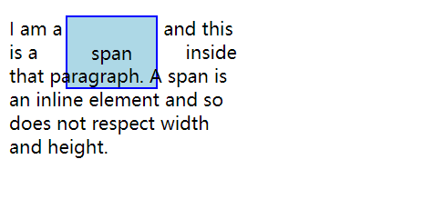

# 盒子模型

## 什么是盒子模型

完整的CSS盒模型应用于块级或者内联元素，只使用盒模型中的定义部分。盒模型中定义了每个部分`外边距（margin）, 边框border, 内边距padding, 内容content`, 合在一起就是我们能够在页面上看到的内容。

### 盒子模型中的各个部分

- `content box`: 这个区域主要用于显示内容，大小可以通过`width`和`height`控制

- `padding box`: 包裹在内容区域外部的空白区域，大小通过`padding`设置

- `border box`: 边框合包裹内容和内边距，大小通过border控制

- `margin box`: 这是最外面的区域，是盒子和其他元素之间的空白区域。大小可以通过margin控制。


### 标准盒子模型

在标准盒子模型中，当我们设置`width`和`heigth`的时候，实际设置的是内容盒子的大小，padding和border再加上设置的高度一起决定了盒子的大小。

例如以下样式设置:

```css
.box {
  width: 350px;
  height: 150px;
  margin: 25px;
  padding: 25px;
  border: 5px solid black;
}
```

如果使用标准模型宽度 = 410px (350 + 25 + 25 + 5 + 5)，高度 = 210px (150 + 25 + 25 + 5 + 5)，padding 加 border 再加 content box。


> margin不计入实际的大小，但是他会影响盒子实际所占空间，但是影响的是盒子的外部空间。盒子范围是到边框为止——不会延伸到margin

### 替代盒模型

CSS中还有一个替代盒模型，在替代盒模型中，盒子的大小并不包含padding和border区域，所有的宽度都是可见的宽度。所以内容的宽度是应该减去边框和内边距。在上面的实例中，则盒子大小为： 宽度=350px, 高度=150px


浏览器会默认使用标准盒模型，如果要使用替代盒模型，可以通过设置`box-sizing: border-box`来实现，则告诉浏览器使用替代盒模型来布局。

```css
.box {
    box-sizing: border-box;
}
```

如果希望所有的元素都使用替代盒模型，则可以让所有元素都继承该属性，例如以下实现:

```css
html {
    box-sizing: border-box;
}


*, *::before, *::after {
    box-sizing: inherit;
}
```

可以使用如下实例查看两者之间的差别:

```html
<!DOCTYPE html>
<html lang="en">
  <head>
    <meta charset="UTF-8" />
    <meta http-equiv="X-UA-Compatible" content="IE=edge" />
    <meta name="viewport" content="width=device-width, initial-scale=1.0" />
    <title>盒子模型</title>
    <style>
      .box {
        margin: 20px;
        padding: 20px;
        border: 5px solid purple;
        width: 300px;
        height: 150px;
        background-color: lightgray;
      }

      .alternative {
        box-sizing: border-box;
      }
    </style>
  </head>
  <body>
    <div class="box">我是标准盒子模型</div>
    <div class="box alternative">我是替代盒子模型</div>
  </body>
</html>
```

## 外边距折叠

当两个盒子都设置了外边距的时候，可能会发生外边距折叠的情况，只有以下三种情况，会发生外边距折叠。

### 同一层相邻元素之间

相邻两个元素之间的外边距折叠，除非后一个元素上加了`clear-fix清除浮动`

例如以下的实例，则最终两个p标签之间的盒子外边距间隔为50px;

```html
<!DOCTYPE html>
<html lang="en">
  <head>
    <meta charset="UTF-8" />
    <meta http-equiv="X-UA-Compatible" content="IE=edge" />
    <meta name="viewport" content="width=device-width, initial-scale=1.0" />
    <title>外边距折叠</title>
    <style>
      p {
        border: 1px solid purple;
      }
      p:nth-child(1) {
        margin-bottom: 50px;
      }
      p:nth-child(2) {
        margin-top: 20px;
      }
    </style>
  </head>
  <body>
    <p>我是第一个P元素</p>
    <p>我是相邻的P元素</p>
    <div style="clear: both"></div>
  </body>
</html>
```

### 没有内容将父元素和后代元素分开

这个情况的外边距的折叠，是有比较高的要求，具体如下

- 第一种情况
  
  - 没有边框border
  
  - 没有内边距padding
  
  - 没有行内内容
  
  - 也没有创建块级格式上下文
  
  - 也没有使用清楚浮动来分割一个块级元素的上边界margin-top与其一个或者多个后代块级元素的上边界margin-top

- 第二种情况
  
  - 没有边框border
  
  - 没有内边距padding
  
  - 没有行内内容
  
  - 没有高度height或者最小高度min-height或者最大高度max-height来分开一个块级元素的下边界margin-bottom与其内的一个或多个后代后代块元素的下边界[`margin-bottom`](https://developer.mozilla.org/zh-CN/docs/Web/CSS/margin-bottom)

#### 解决方案

为了解决父子元素的边距展示在父元素外的问题，主要包含了以下四种解决方案:

- 将margin-top的设置转换为padding-top的实现，只是在实现padding-top的时候，需要重新计算父元素的高度

- 为父元素设置边框属性 

- 使用浮动属性，将元素脱离文档流

- 使用`overflow:hidden`的BFC特性来实现。

当满足以上两种情况的时候，就会出现父块元素和其内后代元素外边界重叠，超过的部分，将溢出到父元素外面

例如以下示例:

```html
<!DOCTYPE html>
<html lang="en">
  <head>
    <meta charset="UTF-8" />
    <meta http-equiv="X-UA-Compatible" content="IE=edge" />
    <meta name="viewport" content="width=device-width, initial-scale=1.0" />
    <title>外边距折叠</title>
    <style>
      p {
        border: 1px solid purple;
      }
      p:nth-child(1) {
        margin-bottom: 50px;
      }
      p:nth-child(2) {
        margin-top: 20px;
      }

      section {
        margin-top: 13px;
        margin-bottom: 87px;
      }
      header {
        margin-top: 87px;
      }

      footer {
        margin-bottom: 13px;
      }
    </style>
  </head>
  <body>
    <p>我是第一个P元素</p>
    <p>我是相邻的P元素</p>
    <div style="clear: both"></div>

    <section>
      <header>上边界重叠87</header>
      <main></main>
      <footer>下边界重叠87 不能再高了</footer>
    </section>
    <p>我是在section之后的元素</p>
  </body>
</html>
```

### 空的块级元素

当一个块级元素的上边界margin-top直接贴到元素的下边界margin-bottom时也会发生边界重叠。这种情况会发生在一下情况：

- 完全没有边框border

- 没有内边距padding

- 没有高度height或者最小高度min-height或者最大高度max-height

- 没有内容设定为Inline

- 元素没有加上clear-fix

### 一些需要注意的地方

- 上述情况的组合会产生更加复杂的外边距重叠

- 即使某一外边距为 0，这些规则仍然适用。因此就算父元素的外边距是 0，第一个或最后一个子元素的外边距仍然会“溢出”到父元素的外面。

- 如果参与折叠的外边距中包含负值，折叠后的外边距的值为最大的正边距与最小的负边距（即绝对值最大的负边距）的和，；也就是说如果有 -13px 8px 100px 叠在一起，边界范围就是 100px -13px 的 87px。

- 如果所有参与折叠的外边距都为负，折叠后的外边距的值为最小的负边距的值。这一规则适用于相邻元素和嵌套元素。

## 块级盒子（Block Box）

一个被定义为块级盒子，具备以下的行为：

- 盒子会在内联的方向上扩展并占据父容器在该方向上的所有空间，在绝大多数情况下会和父容器一样宽

- 每个盒子都会换行

- `width`和`height`属性会发挥作用

- 内边距`padding`，外边距`margin`和边框`border`会将其他元素从当前盒子周围推开

## 内联盒子(Inline Box)

如果一个盒子对外展示为inline样式，则具有以下行为：

- 盒子不会换行

- width和height属性将不起作用

- 垂直方向的内边距，外边距以及边框被应用，但是不会讲其他处于inline状态的盒子推开

- 水平方向的内边距，外边距以及边框被应用，会将水平方向的inline状态的盒子推开

在html标签中，例如`<a>, <em>, <span>`等都是属于内联样式。

## 盒子模型与内联盒子

有些属性也是可以应用到内联盒子的，例如由span创建的那些内联盒子。

例如以下示例：

```html
<!DOCTYPE html>
<html lang="en">
  <head>
    <meta charset="UTF-8" />
    <meta http-equiv="X-UA-Compatible" content="IE=edge" />
    <meta name="viewport" content="width=device-width, initial-scale=1.0" />
    <title>内联盒子属性设置</title>
    <style>
      p {
        width: 200px;
        height: auto;
      }
      span {
        margin: 20px;
        padding: 20px;
        width: 80px;
        height: 50px;
        background-color: lightblue;
        border: 2px solid blue;
      }
    </style>
  </head>
  <body>
    <p>
      I am a paragraph and this is a <span>span</span> inside that paragraph. A
      span is an inline element and so does not respect width and height.
    </p>
  </body>
</html>
```

则展示的结果为:



通过chrome的开发者工具可以知道，在以上的设置了，因为span元素为内联元素，因此对于他的高度和宽度的设置将会失效，但是边框，内边距，外边距是生效的，但是并没有改变span和其他内容之间的关系，因此会和其他元素产生重叠现象。

## 使用`display: inline-block`

display有一个特殊的值，它在内联和块之间提供一个特殊的状态。这对于以下的情况是非常有用的。

当一个元素使用`display: inline-block`时，实现我们需要的块级元素的效果：

- 元素的width和height属性将生效

- 边框，内边距，外边距会将其他元素推开

但是他不会跳转到其他的行，如果显式的增加width和height，他只会展示的比其他的元素更大。

在以上的实例中，我们将span样式中添加`display: inline-block`样式的时候，则展示将会发生变化，


