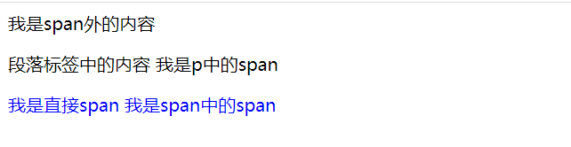

# 选择器类型

## 标签选择器

该选择器在定义的时候指定了某一类的html标签，对该类标签都会生效

```css
h1 {
    color: red;
}
```

## 类选择器

类选择器在定义的时候通过圆点`.`进行定义，使用的时候需要通过`class`属性使用样式定义。

```css
.text {
    font-size: 16px;
    color: green;
}
```

类选择器具有较高的灵活性，因此在实际项目中使用频率较高。

## ID选择器

ID选择样式定义是通过`#`来定义，在使用的过程中通过元素的`id`属性进行引入。

> 在html规范中，id应当具有全局唯一性，因此ID选择器则只能使用一次。当然也是可以不遵守这个规范的。

```css
#text {
    font-size: 17px;
    color: red;
}
```

## 标签属性选择器

标签属性选择器能够根据某一个标签上具有某个属性或者属性的具体值来设置样式，例如以下通过是否包含title属性来设置样式:

```css
a[title] {
    color: green;
}
```

或者根据属性值设置标签的样式：

```css
a[href="https://www.baidu.com"] {
    color: purple;
}
```

## 伪类与伪元素

### 伪类

伪类则是样式话元素的某个状态，例如设置连接的划过状态:

```css
a:hover {
    text-decoration: none;
}
```

### 伪元素

伪类元素则是选择一个元素的部分而不是元素的本身。例如`::first-line`选择元素的第一个行

```css
p::first-line {
    color: blue;
}
```

## 运算符

### 子代选择器

运算符可以将其他的选择器结合起来，形成更复杂的选择器。下面实例运用了`>`选择`<article>`元素的初代子元素。

```css
article > p {
    font-size: 1em;
}
```

在以上子代选择器中，只有它只会匹配那些作为第一个元素的**直接后代 (**子元素) 的第二元素。与之相比，当两个元素由 [后代选择器](https://developer.mozilla.org/zh-CN/docs/Web/CSS/Descendant_combinator) 相连时，它表示匹配存在的所有由第一个元素作为祖先元素 (但不一定是父元素) 的第二个元素，无论它在 DOM 中"跳跃" 多少次。

```html
<!DOCTYPE html>
<html lang="en">
  <head>
    <meta charset="UTF-8" />
    <meta http-equiv="X-UA-Compatible" content="IE=edge" />
    <meta name="viewport" content="width=device-width, initial-scale=1.0" />
    <title>子代选择器</title>
    <style>
      div > span {
        color: blue;
      }
    </style>
  </head>
  <body>
    <div>
      我是span外的内容
      <p>
        段落标签中的内容
        <span>我是p中的span</span>
      </p>
      <span
        >我是直接span
        <span>我是span中的span</span>
      </span>
    </div>
  </body>
</html>

```

则展示的内容为



通过上面可以知道:

- 当span处于p的子元素的时候，这时样式选择器不生效

- 无论span跳了多少级，都能够被选择到

### 兄弟选择器

针对兄弟选择器，位置不需要紧邻，只需要同级即可。`A~B` 选择`A`元素之后所有同层级`B`元素。

```css
p ~ span {
    color: blue;
}
```

例如有以下示例:

```html
<!DOCTYPE html>
<html lang="en">
  <head>
    <meta charset="UTF-8" />
    <meta http-equiv="X-UA-Compatible" content="IE=edge" />
    <meta name="viewport" content="width=device-width, initial-scale=1.0" />
    <title>兄弟选择器</title>
    <style>
      p ~ span {
        font-size: 20px;
        color: blueviolet;
      }
    </style>
  </head>
  <body>
    <p>我是一个p元素</p>
    <p>
      在p之后的元素
      <span>非同级span元素</span>
    </p>
    <span>同级span</span>
    <div>同级div元素</div>
    <span>同级span</span>
  </body>
</html>

```


