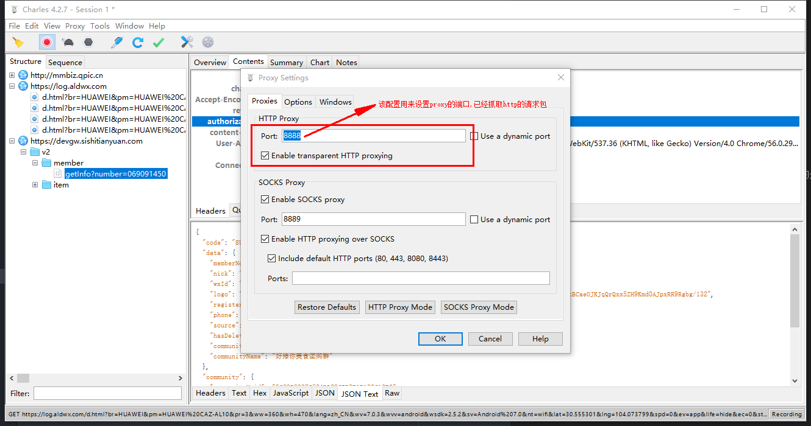
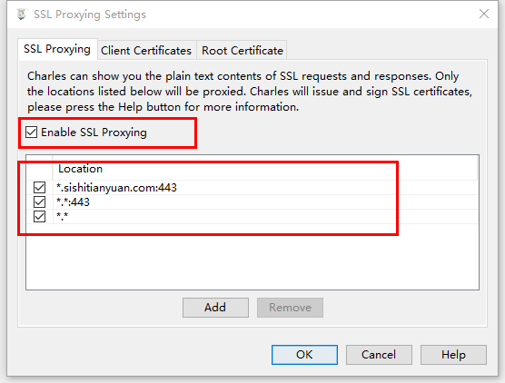
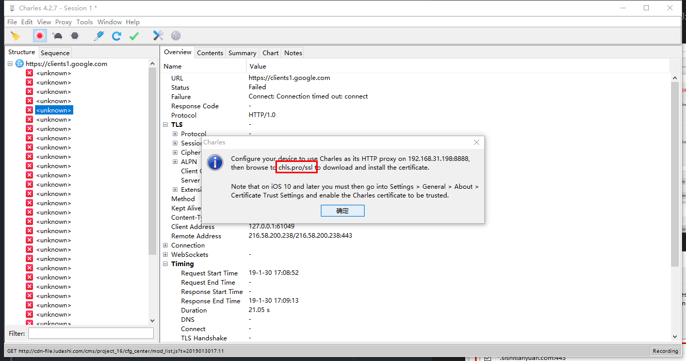
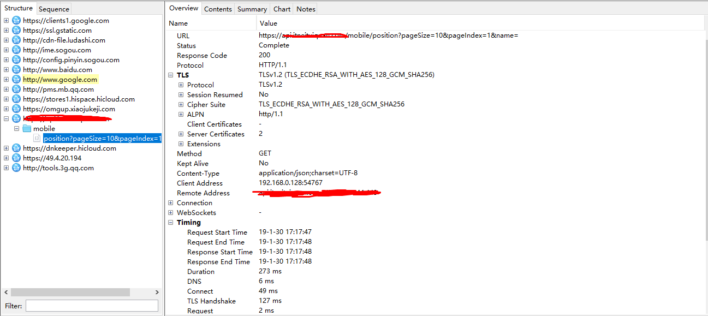

# charles的安装

1. 下载charles[下载地址](https://www.charlesproxy.com/assets/release/4.2.7/charles-proxy-4.2.7-win64.msi)

2. 安装charles

# 配置参数
1. 系统(win10)
2. charles版本: 4.2.7
3. 该软件为收费版本, 后续工作自己在网上找吧
4. 抓包手机: HUAWEI NOVA

# charles配置
我们我们需要配置charles能够抓取http和https的包, 需要做特别的处理

1. proxy -> proxy setting

2. proxy -> SSL proxy setting

该处为必须要配置的, 这里需要配置为你需要抓包的域名, 否则不能正常的抓包哦，可以按照我这样去配置.

3. Help -> ssl proxying -> install charles Root Certificate
该步骤主要用于在window中安装证书, 用于对https加解密进行使用

4. 手机安装证书(Help -> ssl proxying -> install charles Root Certificate On Mobile Device.. )

5. 修改手机网络 -> 设置代理路径为(192.168.31.108:8888)
6. 访问`chls.pro/ssl`
7. 下载并安装证书(对于安卓手机, 如果下载的文件后缀为`.pem`, 则需要修改文件的后缀为`CRT`)
8. 重启电脑(我安装了charles后，因为没有重启，导致了https的请求一直抓包失败, 重启后发现奇迹般正常了)

最后这张图，只是为了证明我自己弄成功了而已, 没有其他的作用
