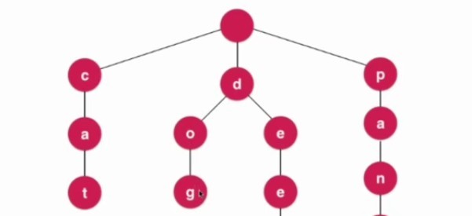

# Trie 字典树
## 什么是Trie
有可以被称为`字典树`, 专门为处理字符串而设计的。可以实现, 查询每个条目的时间复杂度, 和字典中一共有多少个条目无关。



时间复杂度为O(W)
- w 是字符串中的长度


- 每个节点有26个指向下一个节点的指针(根据场景会有不同)
  - 每个节点有若干指向下个节点的指针
- 每一个单词的结尾, 不能单纯的根据是否为叶子节点来区分，每个节点应该有具体的标记

## Trie和前缀搜索
- 前缀搜索可以根据递归或者循环的方式进行前缀的匹配
```java
public boolean isPrefix(String prefix) {
        Node cur = root;
        for (int i = 0, len = prefix.length(); i < len; i++) {
            char c = prefix.charAt(i);
            if (cur.next.get(c) == null) {
                return false;
            }

            cur = cur.next.get(c);
        }

        return true;
    }
```

## Trie 节点的删除
- 根据从底部一个字符的删除
- 如果存在重叠的情况, 则只需要将对应的节点设置为不是单词的节点即可。

## Trie的局限性
- 最大的问题: 空间(是之前空间的`27`倍)
  - Compressed Trie(压缩字典树)
  - Ternary Search Trie(三分搜索树)
    - 左边: < d
    - 中间: == d
    - 右子树: > d
    - 搜索时间, 还是与单词的长度成正比


## 字符串模式识别
- 后缀树

## 更多字符串问题
- 子串查询算法
  - KMP
  - Boyer-Moore
  - Rabin-Karp
- 文件压缩
  - 本质是对超长的字符串进行压缩
- 模式匹配
- 编译原理
- DNA
