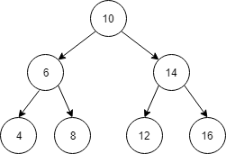

# 树(Tree)

## 树的顺序遍历

1. 前序遍历
前序遍历:
先遍历根节点 -> 左子树 -> 右子树

以上遍历结果为: [10, 6, 4, 8, 14, 12, 16]

2. 中序遍历
中序遍历: 先遍历左子树 -> 根节点 -> 右子树

以上遍历结果为: [4, 6, 8, 10,  12, 14, 16]

3. 后序遍历
后序遍历: 先访问左子节点 -> 右子节点 -> 根节点

以上遍历结果: [4, 8, 6, 12, 16, 14, 10]
