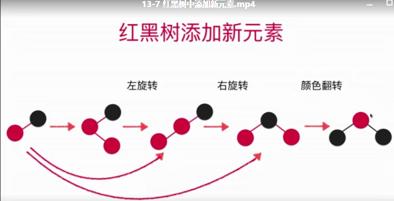

# 红黑树
## 红黑色的特征
- 每个节点或者红色的，或者是黑色的
- 根节点是黑色的
- 每一个叶子节点(最后的空节点)是黑色的
- 如果一个节点是红色的, 那么他的孩子节点都是黑色的
- 从任意一个节点到叶子节点, 经过的黑色节点是一样的(`红色节点向左倾斜`)
## 红黑树与2-3数的等价性

## 2-3 树
- 满足二分搜索树的基本性质(左子树小于根节点, 右子树大于根节点)
- 节点可以存放一个元素或者两个元素
- 每个节点有2个或者3个孩子
- 并不是一个二叉树
- 2-3数是一颗绝对平衡数

### 2-3 数如何维持绝对的平衡
- 插入节点的时候, 不会讲节点插入到一个空节点, 而是与最底层节点进行融合
- 如果插入2-节点, 则直接与根节点进行融合
- 如果插入3-节点, 临时形成四节点, 并将四节点变形，最终形成三个二节点
  - 如果父节点为2-节点, 拆分成三个二节点的子树, 并将节点向上融合,父亲节点形成了一个新的三节点
  - 父节点为三节点: 则将中间节点向上融合, 并再将父节点进行拆分

## 红黑树与2-3树等价
- 如果节点为红色, 则表明了当前节点与父节点在2-3树中是并列的(也就被称之为3-节点)
- 红黑树是保持"黑平衡"的二叉树.(严格意义上, 不是平衡二叉树). 根源在于2-3是绝对平衡的。
- 最大高度是`2logn = O(logN)`

## 2-3树中加入一个元素
- 或者添加进2-节点, 形成一个3-节点
- 或者添加进3-节点， 暂时形成一个4-节点

## 红黑树添加节点
红黑树插入元素, 对应于`2-3树`中, 对应的插入向一个`3-节点`融合一个`2-节点`. 因此，就有三种情况
`例如: 当前红黑树中已有两个数字(37, 42)`
- 向红黑树中插入一个`12`的数字, 这是红黑树所呈现的结构就如"12, 37, 42"的结构, 左子树全部为红色('上图(3)形状').这是就需要使用`右旋转`,形成`(4)`的形状, 这是只需要`颜色翻转`就可以
- 当向红黑数中插入一个`38`时, 形成了`32,38,42`的结构, 如`(2)`的结构, 这是就发现`右子树存在红色节点`, 这是需要通过`左旋转`达到`(3)`的现状, 再重复以上步骤
- 当插入的数字为`48`时, 形成了`32,42,48`的形状, 例如`(4)`的结构, 这是我们只需要做颜色的翻转就可以了

通过对以上三种情况分析, 发现这几种情况可以用如上图的结构继进行统一的表示, 这样就有助于我们对问题的具体分析。

## 红黑树的性能总结
- 对于完全随机的数据, 普通的二分搜索树很好用
- 缺点: 极端情况下退化成为链表(或者高度不平衡)
- `对于查询较多的事情情况下, AVL数很好用`
- 红黑树牺牲了平衡性(2logn的高度)
- `统计性能更优(综合增删改查所有的操作)`

## 更多和红黑树相关的问题
- 红黑树中删除节点
- 红黑树统计性能更优的树(另一种统计性能优秀的树结构 Splay Tree(延伸树))
