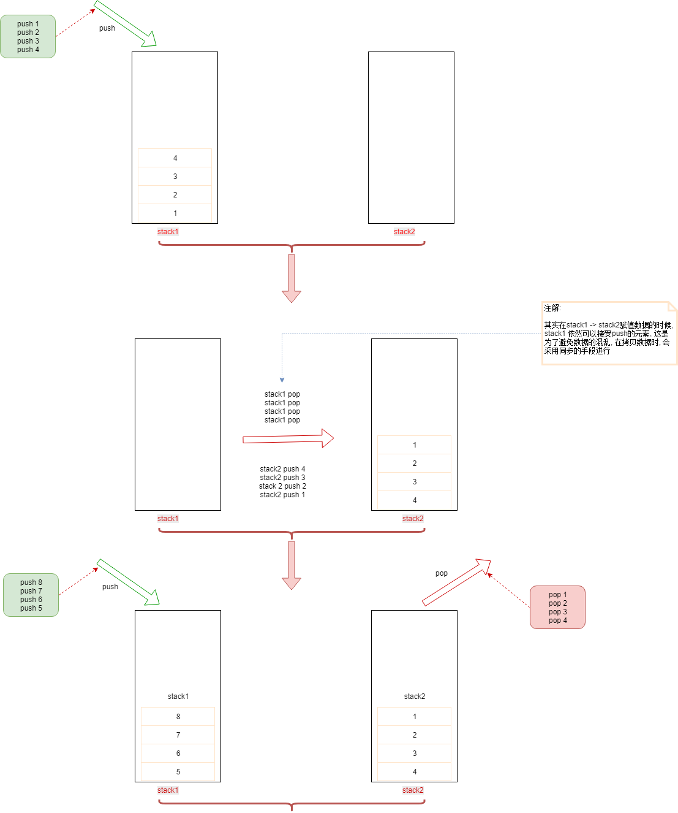

# 利用双栈实现队列

## 题目

> 用两个栈来实现一个队列，完成队列的Push和Pop操作。 队列中的元素为int类型

## 分析

`栈`具备了`先进后出(LIFO)的原则`, 但是`队列`具备`先进先出(FIFO)`的原则。

通过两个栈, 假设具备了`stack1`和`stack2`两个栈, 当我们用`stack1`来接收`push`的值时, 最先进来的元素在栈的最底层, `pop`操作则是取的栈顶的元素。 因此问题就转换了: `如何将stack1中的元素进行反转。`, 这是就可以通过`stack2`来保存`stack1`中已有的元素, 则每次`pop`是从`stack2`中操作元素. 这时就可以实现队列的效果.



## 实现流程

该实现不考虑`多线程情况`, 因此只是阐述实现流程
1. `push`元素, 则将元素压入`stack1`栈顶
2. `pop`元素时, 优先判断`stack2`中是否为空, 如果为空, 则将`stack1`中的所有元素`push`到`stack2`
3. `stack2`中有元素, 则直接`stack2.pop`操作返回.
4. 如果`stack2`为空, 则重复`2步骤`

## 代码实现

```java
import java.util.Stack;

public class Solution {
    Stack<Integer> stack1 = new Stack<Integer>();
    Stack<Integer> stack2 = new Stack<Integer>();

    public void push(int node) {
        // 这里不妨将stack1作为处理加入元素的处理, 这里只负责想栈中加入数据即可
        stack1.push(node);
    }

    public int pop() {
        // 对于pop操作, 则需要进行元素的移动
        if (!stack2.isEmpty()) {
            return stack2.pop();
        }
        while (!stack1.isEmpty()) {
            stack2.push(stack1.pop());
        }

        return stack2.pop();
    }
}
```

## 以上代码的问题

以上代码最大的问题在于不是线程安全的, 虽然`Stack`类在Java中是线程安全的, 但是无法避免在`stack1`到`stack2`赋值元素时, 其他线程没有执行`stack1`的`pop`操作, 这时可能最后进来的元素，先于`stack1`中已有的栈元素.

## 优化后的代码

```java
import java.util.Stack;

public class Solution {
    Stack<Integer> stack1 = new Stack<Integer>();
    Stack<Integer> stack2 = new Stack<Integer>();

    public void push(int node) {
        // 这里不妨将stack1作为处理加入元素的处理, 这里只负责想栈中加入数据即可
        stack1.push(node);
    }

    public int pop() {
        // 对于pop操作, 则需要进行元素的移动
        if (!stack2.isEmpty()) {
            return stack2.pop();
        }

        // 保证在元素拷贝的时候, 不会发生并发问题
        synchronized(stack1) {
          while (!stack1.isEmpty()) {
              stack2.push(stack1.pop());
          }
        }

        return stack2.pop();
    }
}
```
