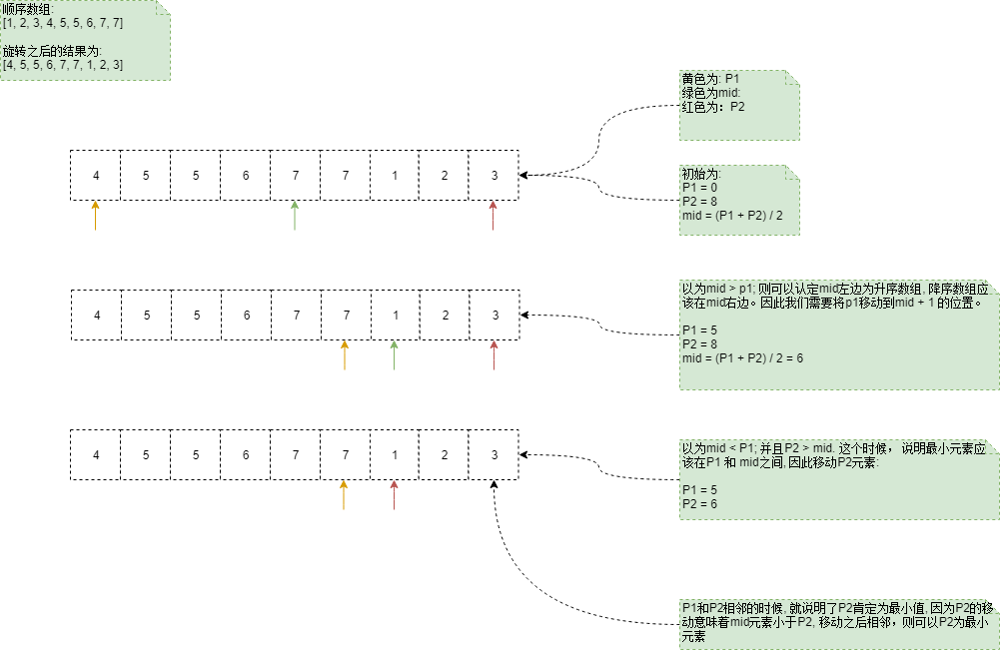

# 旋转数组最小值

## 数组的旋转
是指将一个数组开始若干元素移动到数组末尾, 被称作数组的旋转.

## 题干
 ```
输入一个非减排序的数组的一个旋转，输出旋转数组的最小元素。 例如数组{3,4,5,1,2}为{1,2,3,4,5}的一个旋转，该数组的最小值为1。

NOTE：给出的所有元素都大于0，若数组大小为0，请返回0。
 ````

 ## 分析
 1. 遍历数组
对于一个数组, 需要找到最小值, 可以遍历一次数组, 就可以找到数组中的最小值。当遍历数组的时候, 时间复杂度为: `O(n)`

2. 二分查找法
使用该方法有两个前提条件:
+ 给出的数组是部分有序的数组
+ 最小的元素正好将数组划分为了两个部分a1, a2; a1, a2的靠后元素比前面元素大;

在排序的数组中, 查找元素, 二分查找法的时间复杂父为`O(logn)`.

为了找到中间值, 并且能够根据中间值的与两边索引位置的值进行比较, 因此我们需要两个指针p1, p2。入一下图示.

