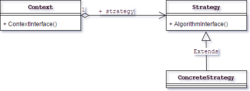

# 策略模式
## 定义
策略模式(Strategy Pattern)是这一种比较简单的模式, 也叫做政策模式（Policy Pattern）, 其定义如下:
> Define a family of algorithms, encapsulate each one, and make them interchangeable.(定义一组算法, 将每个算法都封装起来, 并且使他们之间可以互换)

这个定义非常明确的，清晰的，`定义一组算法`, 看看我们的三个计谋是不是三个算法?`将每个算法都封装起来`, 封装类不就是这个作用吗?`使它们可以互换`当然可以互换了，都是是相同的接口，那当然可以相互转化了。
类图如下:

